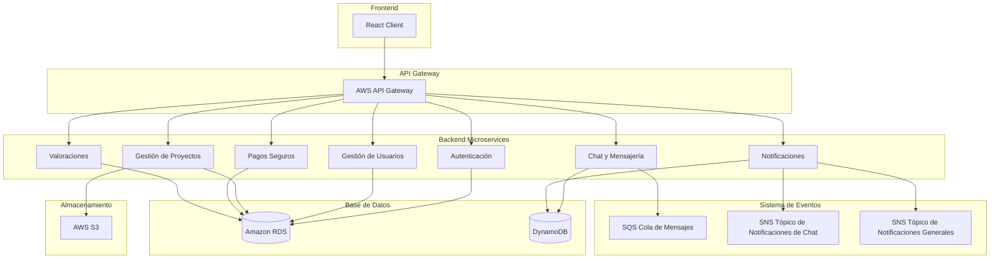
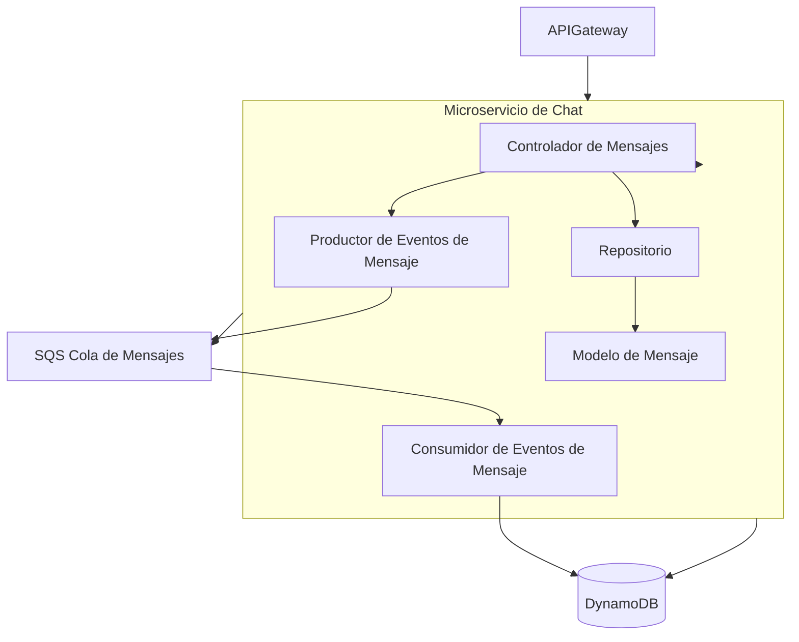
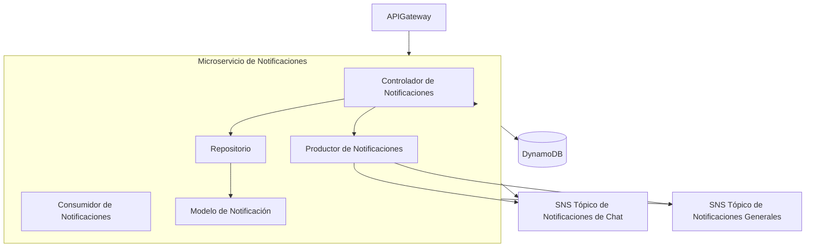

## Índice

0. [Ficha del proyecto](#0-ficha-del-proyecto)
1. [Descripción general del producto](#1-descripción-general-del-producto)
2. [Arquitectura del sistema](#2-arquitectura-del-sistema)
3. [Modelo de datos](#3-modelo-de-datos)
4. [Especificación de la API](#4-especificación-de-la-api)
5. [Historias de usuario](#5-historias-de-usuario)
6. [Tickets de trabajo](#6-tickets-de-trabajo)
7. [Pull requests](#7-pull-requests)

---

## 0. Ficha del proyecto

### **0.1. Tu nombre completo:**

### **0.2. Nombre del proyecto:**

### **0.3. Descripción breve del proyecto:**

Esta plataforma conecta a clientes con profesionales de la industria del bricolaje y la construcción para facilitar la realización de pequeñas obras o reformas. Diseñada con un enfoque en la simplicidad, permite a los usuarios sin conocimientos técnicos describir sus necesidades de forma intuitiva. Los clientes podrán encontrar fácilmente el profesional adecuado para sus proyectos, mientras que los profesionales tendrán acceso a una base de clientes que buscan sus servicios.

### **0.4. URL del proyecto:**

> Puede ser pública o privada, en cuyo caso deberás compartir los accesos de manera segura. Puedes enviarlos a [alvaro@lidr.co](mailto:alvaro@lidr.co) usando algún servicio como [onetimesecret](https://onetimesecret.com/).

### 0.5. URL o archivo comprimido del repositorio

> Puedes tenerlo alojado en público o en privado, en cuyo caso deberás compartir los accesos de manera segura. Puedes enviarlos a [alvaro@lidr.co](mailto:alvaro@lidr.co) usando algún servicio como [onetimesecret](https://onetimesecret.com/). También puedes compartir por correo un archivo zip con el contenido


---

## 1. Descripción general del producto

> Describe en detalle los siguientes aspectos del producto:

### **1.1. Objetivo:**

El objetivo de esta plataforma es conectar a clientes y profesionales del bricolaje y la construcción, simplificando el proceso de contratación para pequeños proyectos y reformas. La plataforma busca reducir las barreras técnicas que muchos clientes encuentran al intentar expresar sus necesidades y ofrecer una experiencia accesible e intuitiva. Para lograrlo, incorpora un sistema de solicitud de presupuestos en el que los clientes describen su proyecto, y solo los profesionales interesados en realizar el trabajo envían sus propuestas económicas y de tiempos.

La plataforma prioriza la transparencia y la seguridad para ambas partes. Los clientes pueden comparar los presupuestos y elegir el profesional que mejor se ajuste a sus expectativas de calidad y precio sin necesidad de realizar búsquedas complejas. Por su parte, los profesionales encuentran un flujo de proyectos de manera constante y pueden certificar su experiencia y habilidades, aumentando su credibilidad y generando confianza entre los clientes.

Además, se incluyen funciones avanzadas como seguimiento de proyecto, valoración de ambas partes y un sistema de pagos seguro que facilita el cumplimiento de los acuerdos. De este modo, la plataforma se convierte en un espacio confiable para que clientes y profesionales puedan gestionar proyectos de bricolaje y construcción con claridad y respaldo, logrando que la experiencia sea satisfactoria para ambos.

### **1.2. Características y funcionalidades principales:**

Aquí tienes una propuesta detallada para el punto 1.2:

---

### 1.2 Características y funcionalidades principales

La plataforma ofrece una variedad de características que facilitan la interacción entre clientes y profesionales en el sector del bricolaje y la construcción. Estas funcionalidades se agrupan en categorías para mejorar la claridad:

#### Funcionalidades de la Plataforma

- **Registro y autenticación**: Proceso sencillo para que clientes y profesionales creen y verifiquen sus cuentas.
- **Solicitud de presupuesto**: Los clientes pueden describir su proyecto, y la plataforma presenta estas solicitudes a profesionales relevantes para que envíen sus presupuestos.
- **Sistema de mensajería y notificaciones**: Comunicación segura entre clientes y profesionales, con notificaciones automáticas para actualizaciones clave (presupuestos recibidos, respuestas de profesionales, etc.).
- **Valoraciones y opiniones**: Al finalizar un proyecto, tanto el cliente como el profesional pueden dejar una valoración y comentario sobre su experiencia, ayudando a construir confianza.
- **Protección de pagos**: Sistema de pagos seguro en el que el cliente paga por adelantado, pero los fondos se liberan al profesional solo al completar el proyecto.
- **Soporte de proyecto y seguimiento**: Opcionalmente, el profesional puede actualizar el estado del proyecto y compartir fotos del progreso, permitiendo al cliente seguir el desarrollo del trabajo.
- **Centro de ayuda y chatbot de asistencia**: Un chatbot inteligente guía al cliente a describir su proyecto de manera precisa y responde dudas comunes.
- **Historial de proyectos y contratos**: Tanto clientes como profesionales pueden acceder a su historial de proyectos realizados y contratos previos.

#### Funcionalidades del Perfil del Cliente

- **Creación de perfil gratuito**: Los clientes pueden crear su perfil sin costo y optar por una suscripción mensual para acceder a funcionalidades avanzadas.
- **Solicitud de ayuda para describir el proyecto**: Con el apoyo del chatbot, los clientes pueden describir sus necesidades sin necesidad de conocimientos técnicos. El chatbot crea una hoja de trabajo detallada que facilita la comprensión por parte de los profesionales.
- **Recepción y comparación de presupuestos**: Los clientes solo ven a los profesionales que han enviado un presupuesto, evitando búsquedas manuales. Pueden revisar las propuestas y seleccionar la mejor opción según sus necesidades.
- **Sistema de valoración de profesionales**: Los clientes pueden dejar una valoración del profesional al finalizar el proyecto, ayudando a construir una reputación en la plataforma.
- **Suscripción a plan avanzado**: Para los clientes interesados en opciones adicionales, se ofrece un plan de pago mensual que incluye funcionalidades avanzadas como prioridad en la asignación de proyectos y soporte dedicado.

#### Funcionalidades del Perfil del Profesional

- **Registro con acreditación**: Los profesionales pueden registrarse y deben proporcionar documentación que acredite su identidad, experiencia y campo profesional.
- **Envío de presupuestos**: Los profesionales pueden revisar solicitudes de proyectos y enviar sus presupuestos directamente a los clientes interesados.
- **Certificación de habilidades y especialización**: Los profesionales pueden destacar áreas de especialización y obtener certificaciones que les permitan ganar credibilidad ante los clientes.
- **Gestión de cartera de proyectos**: Los profesionales pueden administrar sus proyectos y hacer un seguimiento de sus contratos y pagos en la plataforma.
- **Actualización de estado del proyecto**: Pueden mantener al cliente informado del avance del proyecto, proporcionando actualizaciones periódicas con fotos y comentarios.
- **Valoración de clientes**: Los profesionales pueden valorar a los clientes al final del proyecto, lo cual ayuda a otros profesionales a evaluar la confiabilidad de los clientes.

---

#### Funcionalidades Mínimas para el MVP

Para el desarrollo inicial de un Producto Mínimo Viable (MVP), se propone incluir las siguientes funcionalidades esenciales:

1. **Registro y autenticación** para clientes y profesionales.
2. **Creación de solicitud de presupuesto** donde el cliente puede describir su proyecto.
3. **Recepción y envío de presupuestos**: Los profesionales pueden responder con presupuestos a las solicitudes de los clientes.
4. **Sistema de mensajería básica**: Para la comunicación entre cliente y profesional.
5. **Valoración de usuarios**: Los clientes pueden calificar a los profesionales, y viceversa, tras finalizar un proyecto.
6. **Historial básico de proyectos**: Tanto para clientes como para profesionales, permitiendo revisar proyectos pasados.
7. **Sistema de pagos seguro** para proteger la transacción, aunque simplificado para esta fase inicial.

Estas funcionalidades proporcionan el núcleo esencial para una experiencia funcional y fluida en la plataforma. Una vez validado el MVP y recopilado feedback de los usuarios, se podrán agregar las funciones avanzadas para hacer la plataforma más completa y atractiva.

### **1.3. Diseño y experiencia de usuario:**

> Proporciona imágenes y/o videotutorial mostrando la experiencia del usuario desde que aterriza en la aplicación, pasando por todas las funcionalidades principales.

### **1.4. Instrucciones de instalación:**
> Documenta de manera precisa las instrucciones para instalar y poner en marcha el proyecto en local (librerías, backend, frontend, servidor, base de datos, migraciones y semillas de datos, etc.)

---

## 2. Arquitectura del Sistema

### **2.1. Diagrama de arquitectura:**

#### Diagrama Principal de Arquitectura



---

#### Diagrama de Detalle: Microservicio de Chat y Mensajería



- **SQS Queue**: La cola de mensajes SQS permite manejar de manera asíncrona los mensajes enviados por los usuarios. Cuando un mensaje es enviado, se coloca en la cola, y el consumidor lo procesa y lo guarda en DynamoDB.

---

#### Diagrama de Detalle: Microservicio de Notificaciones



- **SNS Topics**:
  - **SNSChatTopic**: Tópico para notificar a los usuarios de nuevos mensajes de chat.
  - **SNSNotificationTopic**: Tópico para notificar a los usuarios de eventos importantes, como nuevos proyectos o presupuestos.

---

#### Diagrama de Despliegue General de la Plataforma

```mermaid
flowchart TD
    subgraph AWSRegion [AWS Región]
        subgraph VPC [VPC (Virtual Private Cloud)]
            APIGateway[AWS API Gateway]
            ECSCluster[AWS ECS Cluster]

            subgraph ECS [ECS Contenedores]
                AuthService[Servicio de Autenticación]
                UserService[Servicio de Usuarios]
                ProjectService[Servicio de Proyectos]
                ChatService[Servicio de Chat]
                NotificationService[Servicio de Notificaciones]
                PaymentService[Servicio de Pagos]
                RatingService[Servicio de Valoraciones]
            end

            RDS[(Amazon RDS)]
            DynamoDB[(Amazon DynamoDB)]
            S3[(Amazon S3)]
        end

        CloudFront[CloudFront CDN]
        Amplify[Amplify - Despliegue Frontend]
        SQSQueue[SQS Cola de Mensajes]
        SNSChatTopic[SNS Tópico de Notificaciones de Chat]
        SNSNotificationTopic[SNS Tópico de Notificaciones Generales]
    end

    ReactClient[Cliente React] --> CloudFront
    CloudFront --> Amplify
    ReactClient --> APIGateway
    APIGateway --> ECSCluster
    ECSCluster --> RDS
    ECSCluster --> DynamoDB
    ECSCluster --> S3
    ChatService --> SQSQueue
    NotificationService --> SNSChatTopic
    NotificationService --> SNSNotificationTopic
```

### **2.2. Descripción de componentes principales:**

La plataforma se compone de varios servicios y tecnologías que trabajan juntos para proporcionar una experiencia fluida y segura para clientes y profesionales. Los componentes principales se dividen en frontend, backend, bases de datos, sistema de eventos, y almacenamiento en la nube. A continuación, se detalla cada uno de ellos.

---

#### **Frontend**

- **React Client**: La interfaz de usuario se implementará en React.js, una biblioteca de JavaScript popular por su eficiencia y capacidad para crear aplicaciones de una sola página (SPA) rápidas y reactivas. React permite la creación de una experiencia de usuario intuitiva, ideal para usuarios sin conocimientos técnicos.
  - **Despliegue en AWS Amplify**: AWS Amplify simplifica el despliegue de aplicaciones frontend y permite integraciones fáciles con servicios backend. Amplify proporciona integración continua (CI/CD), despliegue seguro y autenticación nativa con AWS Cognito.

---

#### **API Gateway**

- **AWS API Gateway**: Este componente actúa como una puerta de enlace para todas las solicitudes del frontend hacia los microservicios del backend. API Gateway maneja la autenticación, la limitación de tasas (rate limiting), y la enrutación de peticiones hacia los microservicios correctos. API Gateway permite añadir lógica de autorización, autenticación y monitoreo a nivel de API.
  - **Ventajas**: API Gateway facilita la implementación de API RESTful y la escalabilidad de los microservicios al distribuir el tráfico según sea necesario.

---

#### **Backend Microservicios**

Cada microservicio está implementado en **Node.js** utilizando **Express** o **NestJS**, dependiendo de la complejidad del servicio. Node.js es conocido por su alta capacidad de manejo de solicitudes en tiempo real, ideal para aplicaciones con componentes de mensajería y notificaciones.

1. **Microservicio de Autenticación**
   - **Descripción**: Gestiona la autenticación de usuarios y la autorización de roles. Este servicio verifica las credenciales de los usuarios y maneja la creación de tokens de autenticación.
   - **Tecnología**: Implementación en Node.js utilizando AWS Cognito para la gestión de autenticación y autorización, y Amazon RDS para el almacenamiento de datos relacionados con la autenticación.
   - **Funcionalidad clave**: Login, registro, y recuperación de contraseñas.

2. **Microservicio de Gestión de Usuarios**
   - **Descripción**: Gestiona los datos de los usuarios, incluyendo información de perfil, suscripciones y preferencias de notificaciones.
   - **Tecnología**: Implementación en Node.js y Express con almacenamiento en Amazon RDS.
   - **Funcionalidad clave**: Creación, edición y consulta de perfiles de usuarios, gestión de suscripciones.

3. **Microservicio de Gestión de Proyectos**
   - **Descripción**: Administra la creación y actualización de proyectos, donde los clientes pueden describir sus necesidades y recibir presupuestos de profesionales.
   - **Tecnología**: Implementación en Node.js y Express con almacenamiento en Amazon RDS para datos estructurados de los proyectos, y almacenamiento en AWS S3 para archivos adjuntos como imágenes o documentos.
   - **Funcionalidad clave**: Creación, actualización y consulta de proyectos.

4. **Microservicio de Chat y Mensajería**
   - **Descripción**: Facilita la comunicación en tiempo real entre clientes y profesionales a través de mensajes de chat. Utiliza una arquitectura basada en eventos para mejorar la escalabilidad y eficiencia del servicio.
   - **Tecnología**: Implementación en Node.js y Express con Amazon SQS para la cola de mensajes y DynamoDB para almacenar los historiales de chat.
   - **Funcionalidad clave**: Envío y recepción de mensajes, almacenamiento de historial de chat, notificaciones de nuevos mensajes a través de SNS.
   
5. **Microservicio de Notificaciones**
   - **Descripción**: Gestiona las notificaciones de la plataforma, incluyendo alertas de nuevos proyectos y presupuestos. Utiliza Amazon SNS para distribuir notificaciones a múltiples suscriptores.
   - **Tecnología**: Implementación en Node.js y Express con Amazon SNS para la entrega de notificaciones en tiempo real y DynamoDB para el registro de notificaciones enviadas.
   - **Funcionalidad clave**: Envío de notificaciones en tiempo real y persistencia de notificaciones para consultas futuras.

6. **Microservicio de Pagos Seguros**
   - **Descripción**: Gestiona el flujo de pagos entre clientes y profesionales, incluyendo pagos adelantados y liberación de fondos al finalizar los proyectos.
   - **Tecnología**: Implementación en Node.js con integración de pasarelas de pago como Stripe o PayPal y almacenamiento en Amazon RDS.
   - **Funcionalidad clave**: Procesamiento de pagos, protección de pagos en fideicomiso (escrow) y liberación de fondos.

7. **Microservicio de Valoraciones**
   - **Descripción**: Gestiona las valoraciones que los clientes y profesionales pueden realizar una vez finalizado un proyecto, permitiendo construir una reputación basada en las experiencias.
   - **Tecnología**: Implementación en Node.js y Express con almacenamiento en Amazon RDS.
   - **Funcionalidad clave**: Creación y consulta de valoraciones de usuarios.

---

#### **Sistema de Eventos**

1. **Amazon SQS (Simple Queue Service)**
   - **Descripción**: SQS gestiona la cola de mensajes para el servicio de chat, permitiendo que los mensajes enviados por los usuarios se almacenen temporalmente en una cola antes de ser procesados.
   - **Función**: Mejorar la escalabilidad y resiliencia del sistema de mensajería, asegurando que los mensajes no se pierdan y se procesen en orden.

2. **Amazon SNS (Simple Notification Service)**
   - **Descripción**: SNS permite la publicación de eventos y su distribución a múltiples suscriptores. Se utiliza para enviar notificaciones en tiempo real tanto para el chat como para alertas de nuevos proyectos y presupuestos.
   - **Función**: Facilitar el envío de notificaciones en tiempo real a los usuarios relevantes (clientes y profesionales) sin cargar el sistema de microservicios.

---

#### **Bases de Datos**

1. **Amazon RDS (Relational Database Service)**
   - **Descripción**: Base de datos relacional gestionada, que proporciona un entorno seguro y escalable para almacenar datos estructurados como perfiles de usuario, proyectos, pagos y valoraciones.
   - **Función**: Almacenar datos estructurados y relacionales de forma eficiente, con soporte para redundancia y recuperación de datos.

2. **Amazon DynamoDB**
   - **Descripción**: Base de datos NoSQL de baja latencia, ideal para manejar grandes volúmenes de datos no estructurados, como el historial de mensajes de chat y el registro de notificaciones.
   - **Función**: Proporcionar almacenamiento flexible y de alta disponibilidad para datos de mensajería y notificaciones.

---

#### **Almacenamiento en la Nube**

- **Amazon S3 (Simple Storage Service)**: Utilizado para almacenar archivos de proyectos, imágenes y documentos adjuntos. S3 es una opción económica y escalable para el almacenamiento de archivos, con una alta disponibilidad y redundancia. Puede integrarse con CloudFront para servir archivos estáticos de manera eficiente.
  - **Función**: Almacenar archivos estáticos y multimedia de manera segura y escalable.

---

Cada uno de estos componentes proporciona una función específica en la arquitectura de microservicios, permitiendo una plataforma modular, escalable y de alto rendimiento. La integración de estos servicios en AWS ofrece ventajas en cuanto a escalabilidad, rendimiento, y reducción de costes iniciales, permitiendo que el sistema se adapte a la demanda conforme la plataforma crece.

### **2.3. Descripción de alto nivel del proyecto y estructura de ficheros**

#### **Componentes Principales del Proyecto**

La plataforma se basa en los siguientes componentes principales:

1. **Frontend**: 
   - Una aplicación cliente en React.js que proporciona la interfaz de usuario.
   - Incluye componentes y servicios para la autenticación, creación de proyectos, gestión de presupuestos, mensajería y notificaciones.
   
2. **API Gateway**:
   - AWS API Gateway centraliza las solicitudes del cliente, controla el tráfico, autentica usuarios y enruta las solicitudes a los microservicios correspondientes en el backend.

3. **Microservicios del Backend**:
   - Implementados en Node.js, cada microservicio es independiente y maneja funciones específicas, lo que facilita su despliegue y escalabilidad de forma individual.
   - Los servicios principales incluyen:
     - **Autenticación**: Maneja el inicio de sesión, el registro y la gestión de sesiones.
     - **Gestión de Usuarios**: Administra la información del perfil y las preferencias.
     - **Gestión de Proyectos**: Permite a los clientes crear y actualizar proyectos, así como recibir presupuestos de los profesionales.
     - **Chat y Mensajería**: Proporciona comunicación en tiempo real entre clientes y profesionales.
     - **Notificaciones**: Envía notificaciones relevantes (nuevos proyectos, presupuestos) a través de Amazon SNS.
     - **Pagos Seguros**: Administra los pagos entre clientes y profesionales, garantizando la protección de fondos mediante escrow.
     - **Valoraciones**: Permite a clientes y profesionales calificar su experiencia una vez completado el proyecto.

4. **Sistema de Eventos**:
   - Amazon SQS y SNS manejan la mensajería y notificaciones en tiempo real, respectivamente, desacoplando la comunicación entre microservicios y mejorando la escalabilidad.

5. **Bases de Datos y Almacenamiento**:
   - **Amazon RDS**: Base de datos relacional para almacenar datos estructurados.
   - **Amazon DynamoDB**: Base de datos NoSQL para datos de mensajería y notificaciones.
   - **Amazon S3**: Almacenamiento de archivos multimedia, documentos y recursos estáticos del proyecto.

---

#### **Estructura de Ficheros de la Aplicación Frontend (React con TypeScript)**

```
frontend/
│
├── public/                     # Archivos estáticos
│   ├── index.html              # Página HTML principal
│   └── assets/                 # Recursos multimedia
│
├── src/
│   ├── components/             # Componentes reutilizables de la UI
│   │   ├── Navbar.tsx
│   │   ├── ChatBox.tsx
│   │   └── ProjectForm.tsx
│   │
│   ├── pages/                  # Páginas principales de la aplicación
│   │   ├── HomePage.tsx
│   │   ├── ProjectPage.tsx
│   │   ├── ProfilePage.tsx
│   │   └── ChatPage.tsx
│   │
│   ├── services/               # Servicios de conexión con la API
│   │   ├── authService.ts
│   │   ├── projectService.ts
│   │   ├── chatService.ts
│   │   └── notificationService.ts
│   │
│   ├── hooks/                  # Custom hooks
│   │   ├── useAuth.ts
│   │   └── useNotifications.ts
│   │
│   ├── context/                # Contexto global de la aplicación
│   │   ├── AuthContext.tsx
│   │   └── NotificationContext.tsx
│   │
│   ├── types/                  # Tipos y interfaces de TypeScript
│   │   ├── User.ts
│   │   ├── Project.ts
│   │   ├── Chat.ts
│   │   └── Notification.ts
│   │
│   ├── utils/                  # Utilidades y funciones auxiliares
│   │   └── formatDate.ts
│   │
│   └── App.tsx                 # Componente raíz
│
└── tsconfig.json               # Configuración de TypeScript
└── package.json                # Configuración de dependencias
```

- **types**: Este directorio contiene las interfaces y tipos definidos en TypeScript, como `User`, `Project`, `Chat`, y `Notification`, que se usan en toda la aplicación para garantizar la tipificación estática.
- **utils**: Funciones auxiliares como `formatDate` u otras que puedan ser útiles en múltiples partes de la aplicación.

---

#### **Estructura de Ficheros de los Microservicios del Backend (Node.js con TypeScript)**

Cada microservicio tiene su propio directorio independiente, utilizando **TypeScript** para aprovechar la tipificación estática y facilitar el mantenimiento.

```
backend/
│
├── auth-service/               # Servicio de Autenticación
│   ├── src/
│   │   ├── controllers/        # Controladores de la API
│   │   │   └── authController.ts
│   │   ├── models/             # Modelos de datos
│   │   │   └── User.ts
│   │   ├── routes/             # Rutas de la API
│   │   │   └── authRoutes.ts
│   │   ├── services/           # Lógica de negocio
│   │   │   └── authService.ts
│   │   ├── utils/              # Utilidades y funciones auxiliares
│   │   │   └── jwtUtil.ts
│   │   ├── types/              # Tipos e interfaces de TypeScript
│   │   │   └── index.ts
│   │   └── index.ts            # Punto de entrada del servicio
│   └── tsconfig.json           # Configuración de TypeScript para este microservicio
│
├── user-service/               # Servicio de Gestión de Usuarios
│   ├── src/
│   │   ├── controllers/
│   │   ├── models/
│   │   ├── routes/
│   │   ├── services/
│   │   ├── types/
│   │   └── index.ts
│   └── tsconfig.json
│
├── project-service/            # Servicio de Gestión de Proyectos
│   ├── src/
│   │   ├── controllers/
│   │   ├── models/
│   │   ├── routes/
│   │   ├── services/
│   │   ├── types/
│   │   ├── utils/              # Utilidades específicas del servicio
│   │   └── index.ts
│   └── tsconfig.json
│
├── chat-service/               # Servicio de Chat y Mensajería
│   ├── src/
│   │   ├── controllers/
│   │   ├── models/
│   │   ├── routes/
│   │   ├── services/
│   │   ├── queue/              # Manejo de colas de mensajes con SQS
│   │   ├── types/
│   │   └── index.ts
│   └── tsconfig.json
│
├── notification-service/       # Servicio de Notificaciones
│   ├── src/
│   │   ├── controllers/
│   │   ├── models/
│   │   ├── routes/
│   │   ├── services/
│   │   ├── sns/                # Configuración de tópicos de SNS
│   │   ├── types/
│   │   └── index.ts
│   └── tsconfig.json
│
└── payment-service/            # Servicio de Pagos Seguros
    ├── src/
    │   ├── controllers/
    │   ├── models/
    │   ├── routes/
    │   ├── services/
    │   ├── types/
    │   └── index.ts
    └── tsconfig.json
```

- **controllers**: Contiene los controladores que gestionan las solicitudes HTTP y llaman a los servicios correspondientes.
- **models**: Contiene los modelos de datos definidos en TypeScript, que representan las entidades principales, como `User`, `Project`, `ChatMessage`, etc.
- **routes**: Define las rutas de la API para cada servicio, vinculando los endpoints con los controladores.
- **services**: Contiene la lógica de negocio para cada microservicio.
- **types**: Define tipos e interfaces para cada servicio, facilitando la reutilización y tipificación estática en el proyecto.
- **utils**: Utilidades y funciones auxiliares que pueden ser específicas para cada servicio, como generación de tokens, validación, formateo, etc.
- **queue y sns**: En los microservicios de `chat-service` y `notification-service`, estos directorios contienen la configuración y manejo de Amazon SQS y SNS, respectivamente.

---

#### Configuración General

Cada microservicio tiene su propio archivo `tsconfig.json` para la configuración de TypeScript, lo que permite que cada servicio sea compilado y desplegado de forma independiente. También es posible usar un archivo `tsconfig.base.json` en la raíz para definir configuraciones comunes que luego se extienden en los archivos `tsconfig.json` de cada microservicio.

---

#### Ejemplo de Flujo de Trabajo con TypeScript

1. **Compilación**: Cada microservicio puede compilarse de forma independiente mediante TypeScript, generando archivos `.js` en un directorio `dist` para su despliegue.
2. **Despliegue**: Los archivos generados en `dist` se despliegan en AWS ECS o Lambda según el diseño de microservicios, permitiendo una integración continua con herramientas como AWS CodePipeline o GitHub Actions.
3. **Validación de Tipos**: Al utilizar TypeScript tanto en el frontend como en el backend, la tipificación estática permite identificar errores en tiempo de desarrollo, mejorando la robustez del código.

Esta estructura modular y orientada a TypeScript facilita el mantenimiento y la escalabilidad del proyecto, permitiendo el despliegue y actualización de servicios de manera independiente.

#### **Estructura de Ficheros del Sistema de Eventos**

El sistema de eventos se implementa directamente en los microservicios de **Chat** y **Notificaciones**, ya que estos son los encargados de interactuar con **Amazon SQS** y **Amazon SNS**. Los archivos de configuración específicos de SQS y SNS se encuentran en los directorios `queue` y `sns` dentro de los microservicios correspondientes.

---

#### **Infraestructura de Bases de Datos y Almacenamiento**

La infraestructura de bases de datos y almacenamiento no tiene una estructura de ficheros en el sentido tradicional, ya que se gestiona mediante servicios en AWS. Sin embargo, la configuración y administración de estos recursos se definen en el despliegue (posiblemente usando herramientas como **AWS CloudFormation** o **Terraform** para mantener la infraestructura como código).

---

#### **Resumen del Flujo de Datos en la Arquitectura**

1. **Autenticación**: Los usuarios inician sesión mediante el frontend en React, que se comunica con el `auth-service` a través del API Gateway.
2. **Creación de Proyectos y Solicitud de Presupuestos**: Los clientes envían los detalles del proyecto al `project-service`, donde los profesionales pueden visualizarlo y enviar presupuestos.
3. **Chat en Tiempo Real**: Los mensajes de chat se envían al `chat-service`, que los coloca en la cola SQS. El servicio procesa los mensajes y envía notificaciones de nuevos mensajes a los usuarios a través de SNS.
4. **Notificaciones**: El `notification-service` envía alertas relevantes a los usuarios (nuevos proyectos, presupuestos) a través de SNS.
5. **Pagos Seguros**: El `payment-service` gestiona los fondos en fideicomiso (escrow) y libera el pago al profesional cuando el proyecto se completa.
6. **Valoraciones**: Al finalizar el proyecto, los clientes y profesionales pueden dejar una valoración a través del `rating-service`.

### **2.4. Infraestructura y despliegue**

La infraestructura está diseñada para soportar una arquitectura de microservicios y permitir escalabilidad, alta disponibilidad y una experiencia de usuario fluida. Utilizamos **AWS** como proveedor de nube, aprovechando sus servicios de contenedores, bases de datos, almacenamiento y notificaciones para ofrecer un entorno robusto y confiable.

---

#### **Infraestructura del Proyecto**

#### **Diagrama de Infraestructura**

```mermaid
flowchart TD
    subgraph AWSRegion [AWS Región]
        subgraph VPC [VPC (Virtual Private Cloud)]
            subgraph PublicSubnet [Subred Pública]
                ALB[Application Load Balancer]
            end

            subgraph PrivateSubnet [Subred Privada]
                ECSCluster[AWS ECS Cluster]
                
                subgraph ECS [Servicios en Contenedores]
                    AuthService[Servicio de Autenticación]
                    UserService[Servicio de Usuarios]
                    ProjectService[Servicio de Proyectos]
                    ChatService[Servicio de Chat]
                    NotificationService[Servicio de Notificaciones]
                    PaymentService[Servicio de Pagos]
                    RatingService[Servicio de Valoraciones]
                end

                RDS[(Amazon RDS)]
                DynamoDB[(Amazon DynamoDB)]
                SQSQueue[SQS Cola de Mensajes]
                SNSChatTopic[SNS Tópico de Notificaciones de Chat]
                SNSNotificationTopic[SNS Tópico de Notificaciones Generales]
            end

            S3[AWS S3]
        end

        CloudFront[CloudFront CDN]
        Amplify[Amplify - Despliegue Frontend]
    end

    ReactClient[Cliente React] --> CloudFront
    CloudFront --> Amplify
    ReactClient --> ALB
    ALB --> ECSCluster
    ECSCluster --> RDS
    ECSCluster --> DynamoDB
    ECSCluster --> SQSQueue
    ECSCluster --> SNSNotificationTopic
    ECSCluster --> SNSChatTopic
    ECSCluster --> S3
```

---

#### **Descripción de Componentes de la Infraestructura**

1. **Amazon VPC (Virtual Private Cloud)**: Se configura una VPC privada para alojar los recursos del proyecto. Dentro de la VPC, se definen una **subred pública** y una **subred privada** para separar el tráfico y aumentar la seguridad.
   - **Subred Pública**: Aloja el **Application Load Balancer (ALB)**, que distribuye el tráfico entrante hacia los microservicios en el clúster ECS.
   - **Subred Privada**: Contiene el clúster de microservicios, bases de datos y colas de mensajería, protegidos de acceso directo desde internet.

2. **Amazon ECS (Elastic Container Service)**: Este servicio gestiona el clúster de contenedores donde se ejecutan los microservicios, cada uno desplegado en contenedores independientes para permitir escalabilidad y despliegue continuo. AWS Fargate puede ser una opción para ejecutar los contenedores sin necesidad de administrar instancias de servidor directamente.

3. **Application Load Balancer (ALB)**: El ALB distribuye las solicitudes entrantes desde los clientes hacia el clúster de ECS, balanceando el tráfico y asegurando la alta disponibilidad. También maneja la autenticación de usuarios y asegura que cada solicitud se redirija al microservicio correspondiente.

4. **Amazon RDS (Relational Database Service)**: Base de datos relacional que almacena datos estructurados, como perfiles de usuario, información de proyectos, transacciones y valoraciones. Configurada en una instancia privada dentro de la VPC, asegura la protección de los datos.

5. **Amazon DynamoDB**: Base de datos NoSQL utilizada para almacenar datos no estructurados, como historiales de mensajes de chat y registros de notificaciones.

6. **Amazon S3 (Simple Storage Service)**: Almacena archivos y recursos estáticos, como imágenes y documentos adjuntos a los proyectos. También sirve archivos multimedia mediante **Amazon CloudFront** para una entrega rápida.

7. **Amazon SQS y SNS**:
   - **SQS (Simple Queue Service)**: Utilizada para la cola de mensajes en el servicio de chat, permite procesar mensajes de manera asíncrona y desacoplar la mensajería en tiempo real del resto de la infraestructura.
   - **SNS (Simple Notification Service)**: Distribuye notificaciones de eventos a los usuarios. Incluye un tópico para notificaciones de chat y otro para notificaciones generales, como nuevos proyectos o presupuestos.

8. **Amazon CloudFront**: Una CDN (Content Delivery Network) que acelera la entrega de contenido estático de la aplicación frontend. Al distribuir el contenido globalmente, CloudFront mejora la velocidad de carga para usuarios de distintas ubicaciones geográficas.

9. **AWS Amplify**: Permite el despliegue y gestión del frontend en React, proporcionando integración continua (CI/CD) y herramientas de autenticación y autorización integradas con AWS Cognito.

---

#### **Proceso de Despliegue**

El proceso de despliegue se basa en principios de integración continua y despliegue continuo (CI/CD) para garantizar que cada componente del sistema se actualice de manera eficiente y sin interrupciones.

#### **1. Despliegue del Frontend (React en AWS Amplify)**

1. **CI/CD con AWS Amplify**: Amplify está conectado al repositorio de código (por ejemplo, GitHub, GitLab). Cada vez que se realiza un commit en la rama principal o en una rama de despliegue, Amplify ejecuta automáticamente el proceso de compilación y despliegue.
2. **CloudFront**: Amplify actualiza los archivos en Amazon S3 y CloudFront distribuye estos archivos a través de su CDN para una entrega rápida a los usuarios.

#### **2. Despliegue de Backend (Microservicios en ECS)**

1. **Build y Test en CI/CD**: Utilizamos una herramienta como AWS CodePipeline o GitHub Actions para ejecutar el pipeline de CI/CD. Cada microservicio tiene su propio archivo Dockerfile y configuración de TypeScript, por lo que cada cambio en el código fuente desencadena:
   - Compilación y validación de TypeScript.
   - Pruebas unitarias y de integración.
   - Generación de la imagen Docker.
   
2. **Almacenamiento en Amazon ECR (Elastic Container Registry)**: Las imágenes Docker de cada microservicio se almacenan en ECR, el registro de contenedores de AWS.

3. **Despliegue en AWS ECS (Elastic Container Service)**: ECS recupera las imágenes de ECR y despliega los contenedores de microservicios en el clúster.
   - **Rolling Updates**: ECS realiza actualizaciones de forma continua (rolling updates), lo que permite desplegar nuevas versiones sin interrumpir el servicio para los usuarios.
   - **Auto Scaling**: ECS permite escalar automáticamente los contenedores según la carga de trabajo. AWS Fargate se puede utilizar para gestionar el escalado y simplificar la gestión de servidores.

#### **3. Bases de Datos y Almacenamiento**

- **Amazon RDS** y **DynamoDB** están configurados y desplegados de forma independiente dentro de la infraestructura en AWS. Estos servicios se gestionan automáticamente mediante políticas de respaldo y recuperación de datos en AWS.
- **Amazon S3** almacena los archivos estáticos y multimedia. El acceso a estos recursos se controla mediante políticas de seguridad y se distribuye globalmente a través de CloudFront.

#### **4. Gestión de Eventos con SQS y SNS**

- **Configuración de colas y tópicos**: Las colas de SQS y los tópicos de SNS se configuran una vez y se integran con los microservicios correspondientes (Chat y Notificaciones).
- **Consumo de mensajes**: Los microservicios escuchan en SQS y SNS para procesar mensajes y notificaciones de forma asíncrona, asegurando una experiencia de usuario en tiempo real.

---

#### **Resumen del Proceso de Despliegue**

1. **Frontend**: Amplify se encarga del despliegue continuo de la aplicación en React. Los cambios en el código se reflejan de forma automática y se distribuyen a través de CloudFront.
2. **Backend**: Cada microservicio se construye y despliega en contenedores Docker mediante ECS, con imágenes almacenadas en ECR y gestionadas por CodePipeline.
3. **Bases de Datos**: RDS y DynamoDB están configurados para ser escalables y asegurar la disponibilidad y durabilidad de los datos.
4. **Mensajería y Notificaciones**: Los mensajes y notificaciones se gestionan mediante SQS y SNS, asegurando un flujo de datos en tiempo real y escalable para los servicios de chat y notificaciones.

Este enfoque de infraestructura y despliegue permite una escalabilidad horizontal y un proceso de actualización continua sin interrupciones, asegurando una plataforma robusta y adaptable a medida que crece el volumen de usuarios y proyectos en la plataforma.

### **2.5. Seguridad**

#### 1. **Autenticación y Autorización**

   - **Autenticación con AWS Cognito**: AWS Cognito se encargará de la autenticación de los usuarios, proporcionando un flujo seguro de inicio de sesión y manejo de sesiones. Utiliza JSON Web Tokens (JWT) para verificar la identidad de los usuarios en cada solicitud.
   - **Autorización basada en roles**: El sistema implementa niveles de acceso en función de los roles (clientes, profesionales, administradores). AWS Cognito y las políticas de IAM (Identity and Access Management) de AWS se utilizan para restringir el acceso a recursos y operaciones específicas según el rol del usuario.
   
   **Ejemplo**: Solo los usuarios con el rol "profesional" podrán enviar presupuestos, mientras que solo los "clientes" podrán crear proyectos.

#### 2. **Comunicación Segura (HTTPS)**

   - **Certificado SSL**: Todo el tráfico entre el cliente (frontend) y el backend estará encriptado mediante HTTPS, utilizando un certificado SSL/TLS. Esto asegura que los datos transmitidos, incluidos datos sensibles como contraseñas y detalles personales, estén protegidos de ataques de intermediarios (man-in-the-middle).
   - **AWS Certificate Manager (ACM)**: Se utiliza ACM para gestionar los certificados SSL/TLS y aplicarlos al Application Load Balancer (ALB), simplificando la configuración y renovación de los certificados.

#### 3. **Protección de API con AWS API Gateway**

   - **Control de acceso y autenticación**: El API Gateway de AWS se configurará para exigir tokens JWT en cada solicitud. Solo los usuarios autenticados podrán acceder a los endpoints, y los tokens se verificarán en cada solicitud.
   - **Limitación de tasas (Rate Limiting)**: Para evitar ataques de denegación de servicio (DDoS), se establece una limitación de tasas en el API Gateway que restringe la cantidad de solicitudes que un usuario o dirección IP puede realizar en un período específico.
   
   **Ejemplo**: Se limita a 100 solicitudes por minuto por usuario, de modo que si un usuario o un bot excede este límite, su acceso se restringe temporalmente.

#### 4. **Seguridad de Bases de Datos**

   - **Control de Acceso a Nivel de Red**: Las bases de datos (Amazon RDS y DynamoDB) se configuran dentro de una subred privada, inaccesible desde internet. Solo los microservicios dentro de la VPC pueden acceder a ellas.
   - **Cifrado en Tránsito y en Reposo**:
      - **Cifrado en tránsito**: La comunicación entre los microservicios y las bases de datos está encriptada usando SSL/TLS.
      - **Cifrado en reposo**: Amazon RDS y DynamoDB almacenan datos encriptados para proteger la información de usuarios, proyectos y transacciones. AWS Key Management Service (KMS) se encarga de gestionar las claves de cifrado.
   
   **Ejemplo**: La información de perfiles de usuario y datos de proyectos se almacenan en Amazon RDS, y todos los datos están encriptados en reposo para evitar la exposición en caso de un acceso no autorizado.

#### 5. **Seguridad de Datos en Amazon S3**

   - **Cifrado de Archivos en Reposo**: Todos los archivos cargados en Amazon S3, como imágenes de proyectos o documentos adjuntos, están encriptados utilizando AES-256.
   - **Control de Acceso a Objetos**: Las políticas de IAM y las políticas de bucket de S3 limitan el acceso a los archivos solo a los usuarios o microservicios que lo necesitan. El acceso público está completamente deshabilitado para evitar la exposición accidental de datos.
   - **AWS CloudFront para Control de Acceso**: Los archivos se distribuyen a través de CloudFront, donde se pueden configurar reglas para permitir el acceso solo a usuarios autenticados, utilizando cookies o tokens de sesión.

#### 6. **Protección contra Ataques de Inyección y Validación de Datos**

   - **Sanitización y Validación de Entradas**: Todos los datos enviados por el usuario se sanitizan y validan tanto en el frontend como en el backend para proteger contra ataques de inyección (como SQL Injection y NoSQL Injection). Esto incluye la validación de datos de formularios en el frontend (React) y la verificación exhaustiva en el backend.
   - **Librerías de Seguridad**: Se utilizan librerías como `express-validator` en Node.js para verificar que los datos cumplan con el formato esperado antes de procesarlos o almacenarlos.

   **Ejemplo**: Antes de guardar un mensaje de chat en la base de datos, el sistema valida que el mensaje no contenga secuencias que puedan interpretarse como comandos de inyección.

#### 7. **Gestión de Secretos y Variables de Entorno**

   - **AWS Secrets Manager y Parameter Store**: Las credenciales sensibles (como claves de acceso a bases de datos, API keys de terceros, etc.) se almacenan de forma segura en AWS Secrets Manager o AWS Parameter Store. Esto evita almacenar credenciales en el código fuente.
   - **Acceso Restringido mediante IAM**: Solo los microservicios que necesitan acceder a estos secretos tienen permisos específicos de IAM, reduciendo el riesgo de exposición.

#### 8. **Monitoreo y Alerta de Seguridad**

   - **AWS CloudWatch**: Utilizado para monitorizar el tráfico, los errores y las métricas de rendimiento en tiempo real de los microservicios. Los logs de acceso y de errores se envían a CloudWatch, lo que permite detectar patrones sospechosos.
   - **AWS GuardDuty**: Herramienta de seguridad que analiza los logs de tráfico y eventos de AWS en busca de comportamientos anómalos y amenazas potenciales, como accesos inusuales o intentos de ataque.
   - **Alertas de Seguridad**: Se configuran alertas en CloudWatch para eventos críticos (como intentos de acceso fallidos repetidos, aumento de errores 500, etc.), permitiendo la respuesta rápida a posibles incidentes.

#### 9. **Políticas de Seguridad de AWS IAM**

   - **Principio de Mínimo Privilegio**: Todos los roles y políticas de IAM siguen el principio de mínimo privilegio, asegurando que cada microservicio y usuario solo tenga acceso a los recursos y acciones estrictamente necesarios.
   - **Rotación de Credenciales**: Las credenciales y claves de acceso de IAM se rotan regularmente, y se revisan los permisos de IAM para mantener la seguridad y minimizar el riesgo de exposición.

#### 10. **Protección de Pagos y Datos Financieros**

   - **Integración con Pasarelas de Pago**: Las transacciones de pago se gestionan a través de pasarelas de pago seguras, como Stripe o PayPal, que cumplen con los estándares de seguridad PCI-DSS.
   - **Tokenización de Pagos**: Los datos sensibles de tarjetas de crédito no se almacenan en el sistema; en su lugar, se utiliza tokenización para proteger los datos financieros, enviando solo tokens de pago que pueden ser procesados de manera segura por la pasarela de pago.

### **2.6. Tests**

#### **1. Pruebas Unitarias**

Las pruebas unitarias se centran en la funcionalidad de componentes individuales, tanto en el frontend como en el backend.

- **Frontend (React con TypeScript)**:
  - **Pruebas de Componentes**: Verificación de que los componentes principales (como formularios, botones y modales) renderizan correctamente y responden a eventos de usuario (clics, entradas de texto).
  - **Pruebas de Servicios**: Los servicios que se comunican con la API (como `authService`, `projectService`) serán probados de manera aislada para garantizar que manejan las respuestas y errores de la API correctamente.

- **Backend (Node.js con TypeScript)**:
  - **Pruebas de Controladores**: Validación de los controladores de API en cada microservicio para verificar que responden adecuadamente a diferentes tipos de solicitudes (GET, POST, PUT, DELETE).
  - **Pruebas de Servicios**: Los servicios internos de cada microservicio se prueban de manera aislada para asegurar que la lógica de negocio funciona correctamente.
  - **Mocks de Dependencias**: Utilización de mocks para simular las interacciones con bases de datos y otros servicios externos.

**Herramientas**: Jest para pruebas en el frontend y backend, y React Testing Library para pruebas de componentes en React.

#### **2. Pruebas de Integración**

Las pruebas de integración garantizan que los diferentes componentes dentro de cada microservicio interactúen correctamente entre sí y que los microservicios funcionen bien en conjunto.

- **Frontend-Backend**: Verificación de que el frontend puede interactuar con los endpoints de la API. Esto incluye probar el flujo de autenticación, la creación de proyectos y el envío de mensajes de chat.
- **Integración de Microservicios**: Validación de la interacción entre microservicios, como:
  - El flujo entre el `auth-service` y `user-service` para validar y gestionar usuarios autenticados.
  - La comunicación entre el `project-service` y `notification-service` para enviar notificaciones cuando se crea o actualiza un proyecto.
  - El uso de colas de mensajes en el `chat-service` con SQS y el `notification-service` con SNS para notificaciones en tiempo real.

**Herramientas**: Jest para el backend, con supertest para pruebas de endpoints de API. En el caso del frontend, se integrarán tests simulando la API.

#### **3. Pruebas de End-to-End (E2E)**

Las pruebas E2E verifican flujos completos desde el punto de vista del usuario final, cubriendo el frontend y la interacción con el backend.

- **Escenarios de Usuario**: Se simulan escenarios clave de usuario, como:
  - Registro e inicio de sesión del usuario.
  - Creación de un proyecto y recepción de presupuestos.
  - Comunicación en tiempo real mediante el chat.
  - Flujo de pagos seguros y valoración de servicios.
- **Automatización de Pruebas E2E**: Utilización de herramientas de automatización para realizar pruebas de los flujos completos de usuario, cubriendo desde el frontend hasta la interacción con los microservicios backend.

**Herramientas**: Cypress para pruebas de E2E, ya que permite automatizar pruebas de frontend y simular las interacciones con el backend en un entorno controlado.

#### **4. Pruebas de Seguridad**

Las pruebas de seguridad son esenciales para identificar posibles vulnerabilidades y asegurar que la aplicación maneje correctamente el acceso y los datos sensibles.

- **Pruebas de Autenticación y Autorización**: Verificación de que solo los usuarios autenticados pueden acceder a los recursos y de que los roles de usuario restringen el acceso a las funcionalidades adecuadas.
- **Pruebas de Inyección y Validación de Entradas**: Pruebas contra vulnerabilidades comunes, como SQL Injection y Cross-Site Scripting (XSS), asegurando que la validación de entradas previene estos ataques.
- **Pruebas de Control de Acceso**: Verificación de que los datos de usuario y los recursos de proyecto están protegidos y solo accesibles a los usuarios autorizados.

**Herramientas**: OWASP ZAP para detectar vulnerabilidades de seguridad en la aplicación y Postman para verificar manualmente los permisos y el control de acceso.

#### **5. Pruebas de Rendimiento**

Las pruebas de rendimiento garantizan que el sistema funcione bien bajo carga y que mantenga tiempos de respuesta adecuados.

- **Pruebas de Carga en el Backend**: Se simula una carga alta de solicitudes para evaluar el rendimiento de los microservicios, especialmente en operaciones críticas como la mensajería y la creación de proyectos.
- **Pruebas de Estrés para el Chat y Notificaciones**: Evaluación del rendimiento del `chat-service` y `notification-service` bajo una carga alta de mensajes y notificaciones, asegurando que el sistema maneje picos de tráfico sin fallos.

**Herramientas**: Locust para pruebas de carga y estrés, y AWS CloudWatch para monitorizar métricas de rendimiento en tiempo real.

---

#### **Resumen de Tests para el MVP**

- **Pruebas Unitarias**: Aseguran que cada componente funcione correctamente de forma aislada.
- **Pruebas de Integración**: Verifican la interacción entre componentes y microservicios.
- **Pruebas de End-to-End (E2E)**: Simulan el flujo completo de usuario para validar la experiencia.
- **Pruebas de Seguridad**: Identifican vulnerabilidades y verifican el control de acceso y autenticación.
- **Pruebas de Rendimiento**: Evalúan la capacidad del sistema para manejar una alta carga y garantizar la eficiencia.

---

## 3. Modelo de Datos

### **3.1. Diagrama del modelo de datos:**

```mermaid
erDiagram

%% Entidad Usuario
USER {
    UUID user_id PK "Identificador único del usuario"
    VARCHAR(255) username UNIQUE NOT NULL "Nombre de usuario"
    VARCHAR(255) email UNIQUE NOT NULL "Correo electrónico del usuario"
    VARCHAR(255) password_hash NOT NULL "Hash de la contraseña del usuario"
    ENUM role NOT NULL "Rol del usuario: cliente o profesional"
    TIMESTAMP created_at DEFAULT CURRENT_TIMESTAMP "Fecha de creación del usuario"
}

%% Entidad Perfil de Usuario
USER_PROFILE {
    UUID profile_id PK "Identificador único del perfil"
    UUID user_id FK "Identificador del usuario"
    VARCHAR(255) full_name NOT NULL "Nombre completo del usuario"
    TEXT bio "Descripción breve o biografía del usuario"
    VARCHAR(255) phone_number UNIQUE "Número de teléfono del usuario"
    VARCHAR(255) location "Ubicación del usuario"
    TIMESTAMP updated_at DEFAULT CURRENT_TIMESTAMP "Fecha de última actualización del perfil"
}

%% Entidad Proyecto
PROJECT {
    UUID project_id PK "Identificador único del proyecto"
    UUID client_id FK "Identificador del cliente que crea el proyecto"
    VARCHAR(255) title NOT NULL "Título del proyecto"
    TEXT description NOT NULL "Descripción del proyecto"
    ENUM status DEFAULT 'open' "Estado del proyecto: abierto, en progreso, completado, cerrado"
    TIMESTAMP created_at DEFAULT CURRENT_TIMESTAMP "Fecha de creación del proyecto"
    TIMESTAMP updated_at DEFAULT CURRENT_TIMESTAMP "Fecha de última actualización del proyecto"
}

%% Entidad Presupuesto
QUOTE {
    UUID quote_id PK "Identificador único del presupuesto"
    UUID project_id FK "Identificador del proyecto"
    UUID professional_id FK "Identificador del profesional que envía el presupuesto"
    DECIMAL(10, 2) amount NOT NULL "Monto del presupuesto"
    ENUM status DEFAULT 'pending' "Estado del presupuesto: pendiente, aceptado, rechazado"
    TIMESTAMP created_at DEFAULT CURRENT_TIMESTAMP "Fecha de creación del presupuesto"
    TIMESTAMP updated_at DEFAULT CURRENT_TIMESTAMP "Fecha de última actualización del presupuesto"
}

%% Entidad Mensaje de Chat
CHAT_MESSAGE {
    UUID message_id PK "Identificador único del mensaje"
    UUID project_id FK "Identificador del proyecto asociado al mensaje"
    UUID sender_id FK "Identificador del usuario que envía el mensaje"
    TEXT content NOT NULL "Contenido del mensaje de chat"
    TIMESTAMP sent_at DEFAULT CURRENT_TIMESTAMP "Fecha y hora en que se envió el mensaje"
}

%% Entidad Valoración
RATING {
    UUID rating_id PK "Identificador único de la valoración"
    UUID project_id FK "Identificador del proyecto relacionado"
    UUID reviewer_id FK "Identificador del usuario que realiza la valoración"
    UUID reviewed_id FK "Identificador del usuario que recibe la valoración"
    INTEGER rating NOT NULL CHECK (rating >= 1 AND rating <= 5) "Calificación en una escala de 1 a 5"
    TEXT comment "Comentario adicional de la valoración"
    TIMESTAMP created_at DEFAULT CURRENT_TIMESTAMP "Fecha de creación de la valoración"
}

%% Relaciones
USER ||--o{ USER_PROFILE : has
USER ||--o{ PROJECT : owns
USER ||--o{ QUOTE : submits
USER ||--o{ CHAT_MESSAGE : sends
USER ||--o{ RATING : gives
PROJECT ||--o{ QUOTE : has
PROJECT ||--o{ CHAT_MESSAGE : includes
PROJECT ||--o{ RATING : receives
```

### **3.2. Descripción de entidades principales:**

#### **1. USER**
- **Descripción**: Representa a cada usuario registrado, ya sea cliente o profesional.
- **Atributos**:
  - `user_id`: UUID, clave primaria.
  - `username`: Nombre de usuario, único y no nulo.
  - `email`: Correo electrónico, único y no nulo.
  - `password_hash`: Hash de la contraseña, no nulo.
  - `role`: Rol del usuario (`cliente` o `profesional`), no nulo.
  - `created_at`: Fecha de creación, valor predeterminado es la fecha y hora actual.
- **Relaciones**:
  - Un usuario puede tener uno o varios perfiles (`USER_PROFILE`).
  - Un usuario puede crear uno o varios proyectos (`PROJECT`).
  - Un usuario puede enviar uno o varios presupuestos (`QUOTE`).
  - Un usuario puede enviar uno o varios mensajes de chat (`CHAT_MESSAGE`).
  - Un usuario puede dar y recibir valoraciones (`RATING`).

#### **2. USER_PROFILE**
- **Descripción**: Detalles adicionales del perfil del usuario, como nombre completo y ubicación.
- **Atributos**:
  - `profile_id`: UUID, clave primaria.
  - `user_id`: UUID, clave foránea que referencia a `USER`.
  - `full_name`: Nombre completo del usuario, no nulo.
  - `bio`: Descripción breve o biografía.
  - `phone_number`: Número de teléfono, único.
  - `location`: Ubicación del usuario.
  - `updated_at`: Fecha de última actualización.
- **Relaciones**:
  - Cada perfil pertenece a un usuario (`USER`).

#### **3. PROJECT**
- **Descripción**: Representa un proyecto creado por un cliente.
- **Atributos**:
  - `project_id`: UUID, clave primaria.
  - `client_id`: UUID, clave foránea que referencia a `USER` (cliente).
  - `title`: Título del proyecto, no nulo.
  - `description`: Descripción detallada del proyecto, no nulo.
  - `status`: Estado del proyecto (abierto, en progreso, completado, cerrado).
  - `created_at` y `updated_at`: Fechas de creación y actualización.
- **Relaciones**:
  - Un proyecto puede tener múltiples presupuestos (`QUOTE`).
  - Un proyecto puede incluir múltiples mensajes de chat (`CHAT_MESSAGE`).
  - Un proyecto puede recibir múltiples valoraciones (`RATING`).

#### **4. QUOTE**
- **Descripción**: Representa un presupuesto enviado por un profesional para un proyecto.
- **Atributos**:
  - `quote_id`: UUID, clave primaria.
  - `project_id`: UUID, clave foránea que referencia a `PROJECT`.
  - `professional_id`: UUID, clave foránea que referencia a `USER` (profesional).
  - `amount`: Monto del presupuesto, no nulo.
  - `status`: Estado del presupuesto (pendiente, aceptado, rechazado).
  - `created_at` y `updated_at`: Fechas de creación y actualización.
- **Relaciones**:
  - Cada presupuesto pertenece a un proyecto (`PROJECT`).
  - Un profesional envía múltiples presupuestos (`USER`).

#### **5. CHAT_MESSAGE**
- **Descripción**: Representa un mensaje de chat entre el cliente y los profesionales interesados en un proyecto.
- **Atributos**:
  - `message_id`: UUID, clave primaria.
  - `project_id`: UUID, clave foránea que referencia a `PROJECT`.
  - `sender_id`: UUID, clave foránea que referencia a `USER`.
  - `content`: Contenido del mensaje de chat, no nulo.
  - `sent_at`: Fecha y hora en que se envió el mensaje.
- **Relaciones**:
  - Cada mensaje está asociado a un proyecto (`PROJECT`).
  - Cada mensaje es enviado por un usuario (`USER`).

#### **6. RATING**
- **Descripción**: Representa una valoración de un usuario hacia otro al completar un proyecto.
- **Atributos**:
  - `rating_id`: UUID, clave primaria.
  - `project_id`: UUID, clave foránea que referencia a `PROJECT`.
  - `reviewer_id`: UUID, clave foránea que referencia a `USER` (quien realiza la valoración).
  - `reviewed_id`: UUID, clave foránea que referencia a `USER` (quien recibe la valoración).
  - `rating`: Calificación numérica (1 a 5), con restricción de rango.
  - `comment`: Comentario adicional de la valoración.
  - `created_at`: Fecha de creación de la valoración.
- **Relaciones**:
  - Cada valoración está asociada a un proyecto (`PROJECT`).
  - Un usuario puede realizar valoraciones hacia otros usuarios (`USER`).

---

## 4. Especificación de la API

A continuación se describe la especificación de los tres endpoints principales de la API para el MVP en formato OpenAPI. Incluye el esquema de autenticación, los parámetros de cada endpoint y ejemplos de petición y respuesta.

---

### **4. Especificación de la API (OpenAPI)**

```yaml
openapi: 3.0.0
info:
  title: Plataforma de Proyectos de Bricolaje y Construcción - API
  version: 1.0.0
  description: API principal para la plataforma, que permite la gestión de usuarios, proyectos, presupuestos y mensajes de chat.

servers:
  - url: https://api.example.com/v1
    description: Servidor de Producción

components:
  securitySchemes:
    BearerAuth:
      type: http
      scheme: bearer
      bearerFormat: JWT

security:
  - BearerAuth: []

paths:
  /auth/login:
    post:
      summary: Iniciar sesión
      tags:
        - Autenticación
      requestBody:
        required: true
        content:
          application/json:
            schema:
              type: object
              properties:
                email:
                  type: string
                  format: email
                  example: "usuario@example.com"
                password:
                  type: string
                  example: "password123"
      responses:
        '200':
          description: Inicio de sesión exitoso
          content:
            application/json:
              schema:
                type: object
                properties:
                  access_token:
                    type: string
                    description: Token JWT para autenticación.
                    example: "eyJhbGciOiJIUzI1NiIsInR5cCI6IkpXVCJ9..."
        '401':
          description: Credenciales inválidas
          content:
            application/json:
              schema:
                type: object
                properties:
                  message:
                    type: string
                    example: "Credenciales incorrectas"
      
  /projects:
    post:
      summary: Crear un nuevo proyecto
      tags:
        - Proyectos
      security:
        - BearerAuth: []
      requestBody:
        required: true
        content:
          application/json:
            schema:
              type: object
              properties:
                title:
                  type: string
                  example: "Reforma de baño"
                description:
                  type: string
                  example: "Necesito reformar el baño completo, incluyendo plomería y azulejos."
      responses:
        '201':
          description: Proyecto creado exitosamente
          content:
            application/json:
              schema:
                type: object
                properties:
                  project_id:
                    type: string
                    description: ID del proyecto creado.
                    example: "uuid-del-proyecto"
                  title:
                    type: string
                    example: "Reforma de baño"
                  description:
                    type: string
                    example: "Necesito reformar el baño completo, incluyendo plomería y azulejos."
                  status:
                    type: string
                    example: "open"
                  created_at:
                    type: string
                    format: date-time
                    example: "2024-11-03T14:55:00Z"
        '401':
          description: Usuario no autenticado
        '400':
          description: Datos de entrada inválidos

  /projects/{project_id}/quotes:
    post:
      summary: Enviar presupuesto para un proyecto
      tags:
        - Presupuestos
      security:
        - BearerAuth: []
      parameters:
        - in: path
          name: project_id
          required: true
          schema:
            type: string
            example: "uuid-del-proyecto"
          description: ID del proyecto al que se enviará el presupuesto
      requestBody:
        required: true
        content:
          application/json:
            schema:
              type: object
              properties:
                amount:
                  type: number
                  format: double
                  example: 1500.00
                message:
                  type: string
                  example: "Este es el presupuesto para la reforma de su baño, incluye materiales y mano de obra."
      responses:
        '201':
          description: Presupuesto enviado exitosamente
          content:
            application/json:
              schema:
                type: object
                properties:
                  quote_id:
                    type: string
                    description: ID del presupuesto creado.
                    example: "uuid-del-presupuesto"
                  project_id:
                    type: string
                    example: "uuid-del-proyecto"
                  amount:
                    type: number
                    format: double
                    example: 1500.00
                  status:
                    type: string
                    example: "pending"
                  created_at:
                    type: string
                    format: date-time
                    example: "2024-11-03T15:00:00Z"
        '401':
          description: Usuario no autenticado
        '404':
          description: Proyecto no encontrado
```

---

### **Descripción de los Endpoints**

#### **1. Autenticación: Iniciar Sesión**

- **Endpoint**: `POST /auth/login`
- **Descripción**: Permite a los usuarios iniciar sesión en la plataforma.
- **Parámetros**:
  - **Body**:
    - `email`: Correo electrónico del usuario (string, requerido).
    - `password`: Contraseña del usuario (string, requerido).
- **Respuesta**:
  - `200 OK`: Devuelve un token JWT en el campo `access_token` si las credenciales son válidas.
  - `401 Unauthorized`: Devuelve un mensaje de error si las credenciales son incorrectas.

##### **Ejemplo de Petición**
```json
{
  "email": "usuario@example.com",
  "password": "password123"
}
```

##### **Ejemplo de Respuesta**
```json
{
  "access_token": "eyJhbGciOiJIUzI1NiIsInR5cCI6IkpXVCJ9..."
}
```

---

#### **2. Proyectos: Crear Proyecto**

- **Endpoint**: `POST /projects`
- **Descripción**: Permite a los clientes crear un nuevo proyecto.
- **Autenticación**: Requiere un token JWT válido en el encabezado `Authorization`.
- **Parámetros**:
  - **Body**:
    - `title`: Título del proyecto (string, requerido).
    - `description`: Descripción detallada del proyecto (string, requerido).
- **Respuesta**:
  - `201 Created`: Devuelve el ID del proyecto creado, junto con los detalles básicos.
  - `401 Unauthorized`: Devuelve un mensaje de error si el usuario no está autenticado.
  - `400 Bad Request`: Devuelve un mensaje de error si los datos de entrada son inválidos.

##### **Ejemplo de Petición**
```json
{
  "title": "Reforma de baño",
  "description": "Necesito reformar el baño completo, incluyendo plomería y azulejos."
}
```

##### **Ejemplo de Respuesta**
```json
{
  "project_id": "uuid-del-proyecto",
  "title": "Reforma de baño",
  "description": "Necesito reformar el baño completo, incluyendo plomería y azulejos.",
  "status": "open",
  "created_at": "2024-11-03T14:55:00Z"
}
```

---

#### **3. Presupuestos: Enviar Presupuesto**

- **Endpoint**: `POST /projects/{project_id}/quotes`
- **Descripción**: Permite a los profesionales enviar un presupuesto para un proyecto específico.
- **Autenticación**: Requiere un token JWT válido en el encabezado `Authorization`.
- **Parámetros**:
  - **Path**:
    - `project_id`: ID del proyecto al que se enviará el presupuesto (string, requerido).
  - **Body**:
    - `amount`: Monto del presupuesto (number, requerido).
    - `message`: Mensaje adicional con detalles del presupuesto (string, opcional).
- **Respuesta**:
  - `201 Created`: Devuelve el ID del presupuesto creado y los detalles básicos.
  - `401 Unauthorized`: Devuelve un mensaje de error si el usuario no está autenticado.
  - `404 Not Found`: Devuelve un mensaje de error si el proyecto no existe.

##### **Ejemplo de Petición**
```json
{
  "amount": 1500.00,
  "message": "Este es el presupuesto para la reforma de su baño, incluye materiales y mano de obra."
}
```

##### **Ejemplo de Respuesta**
```json
{
  "quote_id": "uuid-del-presupuesto",
  "project_id": "uuid-del-proyecto",
  "amount": 1500.00,
  "status": "pending",
  "created_at": "2024-11-03T15:00:00Z"
}
```

## 5. Historias de Usuario

Aquí tienes las historias de usuario para el MVP, detalladas y con los casos de uso separados para una mayor claridad.

---

### **Historia de Usuario 1: Registro y Autenticación de Usuario**

#### **1.1 Registro de Usuario**

> **Como** usuario nuevo, **quiero** registrarme en la plataforma **para** poder acceder a las funcionalidades de proyectos y presupuestos.

- **Criterios de Aceptación**:
  - El usuario debe poder registrarse proporcionando los siguientes datos obligatorios:
    - Correo electrónico único
    - Nombre de usuario único
    - Contraseña segura
  - El sistema valida que el correo electrónico y el nombre de usuario sean únicos y muestra un mensaje de error si ya existen.
  - El usuario recibe un correo de confirmación para activar su cuenta antes de iniciar sesión.
  - La contraseña debe cumplir con los requisitos de seguridad (mínimo 8 caracteres, al menos una mayúscula, un número y un carácter especial).
  - Al completar el registro, el usuario es redirigido a la pantalla de confirmación.

#### **1.2 Inicio de Sesión**

> **Como** usuario registrado, **quiero** iniciar sesión en la plataforma **para** acceder a mis proyectos, presupuestos y funciones de comunicación de forma segura.

- **Criterios de Aceptación**:
  - El usuario debe poder iniciar sesión con su correo electrónico o nombre de usuario y su contraseña.
  - Si las credenciales son correctas, el sistema genera un token JWT y lo devuelve al usuario para futuras autenticaciones.
  - Si las credenciales son incorrectas, el sistema muestra un mensaje de error y no permite el acceso.
  - El token JWT tiene un tiempo de expiración adecuado, y el usuario debe volver a iniciar sesión una vez caducado.

---

### **Historia de Usuario 2: Creación y Gestión de Proyectos por el Cliente**

#### **2.1 Crear Proyecto**

> **Como** cliente, **quiero** crear un proyecto detallando mis necesidades de bricolaje o reforma **para** recibir presupuestos de profesionales interesados.

- **Criterios de Aceptación**:
  - El cliente debe poder crear un proyecto proporcionando:
    - Título del proyecto (obligatorio)
    - Descripción detallada del proyecto (obligatorio)
  - El proyecto se guarda en el sistema con el estado “abierto” y está disponible para que los profesionales lo vean y envíen presupuestos.
  - Si el título o la descripción están vacíos, el sistema muestra un mensaje de error y no permite crear el proyecto.
  - Al crear el proyecto, el cliente es redirigido a la pantalla de detalles del proyecto.

#### **2.2 Ver Proyectos Propios**

> **Como** cliente, **quiero** ver una lista de los proyectos que he creado **para** hacer seguimiento de los presupuestos recibidos y el estado de cada proyecto.

- **Criterios de Aceptación**:
  - El cliente debe poder ver una lista de todos sus proyectos, incluyendo el título, estado y fecha de creación de cada uno.
  - Para cada proyecto, el cliente debe poder ver los presupuestos asociados y su estado (pendiente, aceptado, rechazado).
  - La lista de proyectos se ordena por fecha de creación, mostrando los proyectos más recientes primero.

#### **2.3 Actualizar Proyecto**

> **Como** cliente, **quiero** poder actualizar los detalles de un proyecto que he creado **para** añadir o corregir información importante antes de aceptar un presupuesto.

- **Criterios de Aceptación**:
  - El cliente debe poder editar el título y la descripción del proyecto.
  - Las actualizaciones solo están permitidas si el proyecto está en estado “abierto” (no se puede editar un proyecto una vez aceptado un presupuesto).
  - El sistema valida los datos ingresados nuevamente y guarda las actualizaciones.
  - Tras actualizar, el cliente es redirigido a la pantalla de detalles del proyecto con los cambios reflejados.

---

### **Historia de Usuario 3: Envío y Gestión de Presupuestos por el Profesional**

#### **3.1 Enviar Presupuesto para un Proyecto**

> **Como** profesional, **quiero** enviar un presupuesto a un proyecto de cliente **para** ofrecer mis servicios y participar en la contratación.

- **Criterios de Aceptación**:
  - El profesional debe poder enviar un presupuesto para un proyecto “abierto”, proporcionando:
    - Monto del presupuesto (obligatorio)
    - Mensaje explicativo o detalles adicionales (opcional)
  - El presupuesto se guarda con el estado “pendiente” y el cliente es notificado de la recepción del presupuesto.
  - El profesional recibe un mensaje de confirmación al enviar el presupuesto.
  - El profesional no puede enviar más de un presupuesto para el mismo proyecto (solo puede modificar o retirar el presupuesto enviado).

#### **3.2 Ver Presupuestos Propios**

> **Como** profesional, **quiero** ver una lista de los presupuestos que he enviado **para** revisar su estado y hacer seguimiento de los proyectos que me interesan.

- **Criterios de Aceptación**:
  - El profesional debe poder ver una lista de los presupuestos enviados, incluyendo:
    - Título del proyecto asociado
    - Estado del presupuesto (pendiente, aceptado, rechazado)
    - Monto del presupuesto
    - Fecha de envío del presupuesto
  - La lista de presupuestos se ordena por fecha de creación, mostrando primero los más recientes.
  - Al seleccionar un presupuesto, el profesional puede ver los detalles del proyecto y el mensaje enviado junto con el presupuesto.

#### **3.3 Modificar o Retirar Presupuesto**

> **Como** profesional, **quiero** poder modificar o retirar un presupuesto enviado **para** actualizar la oferta o cancelar mi participación antes de que el cliente lo acepte.

- **Criterios de Aceptación**:
  - El profesional debe poder editar el monto y el mensaje de un presupuesto en estado “pendiente” hasta que el cliente lo acepte.
  - Si el profesional retira un presupuesto, el estado cambia a “retirado” y el cliente recibe una notificación de que el presupuesto ha sido cancelado.
  - El profesional no puede modificar un presupuesto una vez que el cliente lo ha aceptado o rechazado.
  
---

## 6. Tickets de Trabajo

Para documentar los tickets de trabajo, cada uno se enfocará en una parte específica del proyecto (backend, frontend y bases de datos). Los tickets detallarán los objetivos, los criterios de aceptación, los pasos a seguir, las dependencias y cualquier consideración adicional necesaria para su correcta implementación.

---

#### **Ticket de Trabajo 1: Backend - Implementar Endpoint para Crear Proyecto**

- **ID**: BE-001
- **Título**: Implementar Endpoint para Crear Proyecto
- **Prioridad**: Alta
- **Justificación de Prioridad**: La capacidad de crear proyectos es una funcionalidad central para los clientes en el MVP, y muchos otros procesos dependen de este endpoint. Por lo tanto, este ticket tiene prioridad alta para asegurar que los clientes puedan crear proyectos en la plataforma.
- **Descripción**: Implementar un endpoint en el `project-service` que permita a un cliente crear un nuevo proyecto proporcionando un título y una descripción. Este endpoint debe validar los datos de entrada, almacenar el proyecto en la base de datos y devolver los detalles del proyecto creado.

- **Criterios de Aceptación**:
  - El endpoint debe aceptar una solicitud `POST` en la ruta `/projects`.
  - La solicitud debe incluir un token JWT en el encabezado `Authorization`.
  - El cuerpo de la solicitud debe contener los campos `title` (string) y `description` (string).
  - Si los datos de entrada son válidos y el usuario está autenticado, el proyecto debe ser creado y almacenado en la base de datos con el estado `open`.
  - El endpoint debe devolver una respuesta `201 Created` con los detalles del proyecto (ID, título, descripción, estado, fechas de creación).
  - En caso de datos de entrada inválidos, el endpoint debe devolver un `400 Bad Request` con un mensaje de error.
  - Si el usuario no está autenticado, el endpoint debe devolver un `401 Unauthorized`.

- **Pasos para Desarrollar la Tarea**:
  1. **Crear Rutas**: Añadir la ruta `POST /projects` en el archivo de rutas del `project-service`.
  2. **Crear Controlador**: Implementar el método `createProject` en el controlador, que se encargue de validar los datos de entrada y llamar al servicio correspondiente.
  3. **Validar Datos**: Usar una librería como `express-validator` para validar que `title` y `description` no estén vacíos.
  4. **Implementar Servicio**: Crear un servicio que interactúe con el modelo de la base de datos para guardar el nuevo proyecto. Asegurarse de que el `client_id` se asigne a partir del token JWT decodificado.
  5. **Actualizar Modelo**: Revisar el modelo `Project` para asegurarse de que se incluyan todos los campos requeridos y que las restricciones (como `NOT NULL`) estén configuradas correctamente.
  6. **Escribir Tests**: Crear pruebas unitarias y de integración usando `Jest` para verificar que:
     - El proyecto se crea correctamente cuando los datos son válidos.
     - Se devuelve un error `400` si faltan datos obligatorios.
     - Se devuelve un error `401` si el usuario no está autenticado.
  7. **Actualizar Documentación**: Asegurarse de que el endpoint esté documentado en la especificación de OpenAPI (Swagger) y que los ejemplos de peticiones y respuestas sean claros.
  8. **Realizar Code Review**: Solicitar una revisión de código antes de hacer merge a la rama principal.

- **Dependencias**:
  - Debe estar implementada la autenticación y autorización mediante JWT.
  - El modelo `Project` debe estar configurado en la base de datos.

---

#### **Ticket de Trabajo 2: Frontend - Implementar Formulario de Creación de Proyecto**

- **ID**: FE-001
- **Título**: Implementar Formulario de Creación de Proyecto
- **Prioridad**: Media
- **Justificación de Prioridad**: El formulario de creación de proyectos es fundamental para la experiencia del usuario, ya que permite a los clientes crear y detallar sus proyectos. Sin embargo, depende del endpoint del backend (`BE-001`), por lo que su prioridad es media y su desarrollo se puede planificar tras la implementación del endpoint.
- **Descripción**: Crear un formulario en la interfaz de usuario para que los clientes puedan crear un proyecto, proporcionando un título y una descripción. Este formulario debe validar los campos de entrada y enviar la solicitud al backend mediante un servicio API.

- **Criterios de Aceptación**:
  - El formulario debe incluir los siguientes campos:
    - `title`: Input de texto para el título del proyecto, requerido.
    - `description`: Textarea para la descripción del proyecto, requerido.
  - El formulario debe validar que ambos campos estén completos antes de permitir el envío.
  - Si los datos son válidos, el formulario debe realizar una solicitud `POST` al endpoint `/projects` del backend.
  - Debe mostrar un mensaje de éxito si el proyecto se crea correctamente y redirigir al usuario a la vista de detalles del proyecto.
  - En caso de error, debe mostrar un mensaje adecuado (por ejemplo, "El título es obligatorio" o "Por favor, inicie sesión").
  - Debe ser compatible con dispositivos móviles (diseño responsive).

- **Pasos para Desarrollar la Tarea**:
  1. **Crear Componente**: Crear un componente `ProjectForm.tsx` en el directorio `components/`.
  2. **Definir el Formulario**: Utilizar `React Hook Form` para gestionar el formulario y aplicar validaciones.
  3. **Integrar Servicio API**: En el directorio `services/`, crear o actualizar el archivo `projectService.ts` para incluir la función `createProject` que realice la solicitud `POST`.
  4. **Mostrar Mensajes**: Usar un `Toast` o componente de notificación para mostrar el mensaje de éxito o error al usuario.
  5. **Pruebas Unitarias**: Escribir pruebas con `React Testing Library` para verificar:
     - La visualización del formulario.
     - Las validaciones de los campos.
     - La llamada al servicio `createProject` cuando el formulario es válido.
     - El manejo de errores (mostrar mensajes adecuados).
  6. **Estilos Responsivos**: Asegurarse de que el formulario se adapte a diferentes tamaños de pantalla usando `styled-components` o `CSS modules`.
  7. **Revisión de Accesibilidad**: Verificar que el formulario sea accesible, con etiquetas `aria` adecuadas para los campos y botones.
  8. **Realizar Code Review**: Solicitar una revisión de código antes de hacer merge a la rama principal.

- **Dependencias**:
  - El endpoint `POST /projects` en el backend debe estar disponible.
  - El usuario debe estar autenticado para crear un proyecto.

---

#### **Ticket de Trabajo 3: Base de Datos - Crear Tabla para Almacenar Proyectos**

- **ID**: DB-001
- **Título**: Crear Tabla `projects` para Almacenar Información de Proyectos
- **Prioridad**: Alta
- **Justificación de Prioridad**: La tabla `projects` es esencial para almacenar los proyectos creados por los clientes. Este ticket tiene prioridad alta ya que es un requisito previo para implementar el endpoint de creación de proyectos (BE-001).
- **Descripción**: Crear la tabla `projects` en la base de datos para almacenar la información de los proyectos creados por los clientes, incluyendo las claves necesarias para enlazar los proyectos con los usuarios (clientes).

- **Criterios de Aceptación**:
  - La tabla `projects` debe incluir las siguientes columnas:
    - `project_id` (UUID, PK): Identificador único del proyecto.
    - `client_id` (UUID, FK): Identificador del cliente que creó el proyecto.
    - `title` (VARCHAR(255), NOT NULL): Título del proyecto.
    - `description` (TEXT, NOT NULL): Descripción detallada del proyecto.
    - `status` (ENUM: `open`, `in_progress`, `completed`, `closed`, DEFAULT `open`): Estado del proyecto.
    - `created_at` (TIMESTAMP, DEFAULT CURRENT_TIMESTAMP): Fecha y hora de creación.
    - `updated_at` (TIMESTAMP, DEFAULT CURRENT_TIMESTAMP): Fecha y hora de última actualización.
  - La columna `client_id` debe ser una clave foránea que referencia a `user_id` de la tabla `users`.
  - La tabla debe incluir índices para `client_id` y `status` para optimizar las consultas.

- **Pasos para Desarrollar la Tarea**:
  1. **Definir la Migración**: Crear un script de migración SQL para definir la tabla `projects` con las columnas y restricciones indicadas.
  2. **Definir las Relaciones**: Asegurarse de que `client_id` esté correctamente relacionado con la tabla `users` mediante una clave foránea.
  3. **Implementar Índices**: Definir índices en `client_id` y `status` para mejorar el rendimiento de las consultas que filtren proyectos por cliente o estado.
  4. **Ejecutar la Migración**: Aplicar el script de migración en el entorno de desarrollo y verificar que la tabla se haya creado correctamente.
  5. **Pruebas de Integridad**: Realizar pruebas de integridad para verificar que:
     - No se puedan insertar proyectos sin un `client_id` válido.
     - No se puedan insertar proyectos con títulos o descripciones vacíos.
  6. **Documentar la Migración**: Asegurarse de que la migración esté documentada en el archivo `README` del repositorio de migraciones.
  7. **Realizar Code Review**: Solicitar una revisión de la migración antes de aplicarla en el entorno de producción.

- **Dependencias**:
  - La tabla `users` debe estar disponible con la columna `user_id` como clave primaria.

---

## 7. Pull Requests

> Documenta 3 de las Pull Requests realizadas durante la ejecución del proyecto

**Pull Request 1**
Primera PR para la generación de la documentación del proyecto.
Desde la rama 'documentation' a la rama 'main'.
Descripción: Se ha creado la documentación del proyecto en formato Markdown, incluyendo la estructura de ficheros, el diagrama del modelo de datos, la especificación de la API, y una introducción a la arquitectura del proyecto.
**Pull Request 2**

**Pull Request 3**

