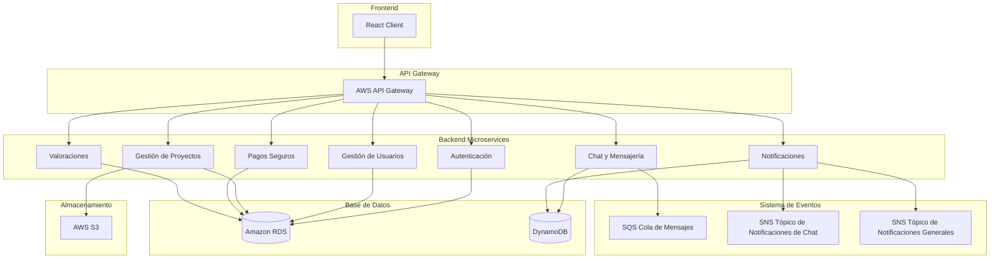
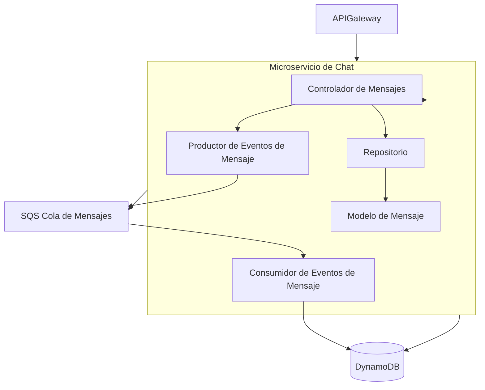
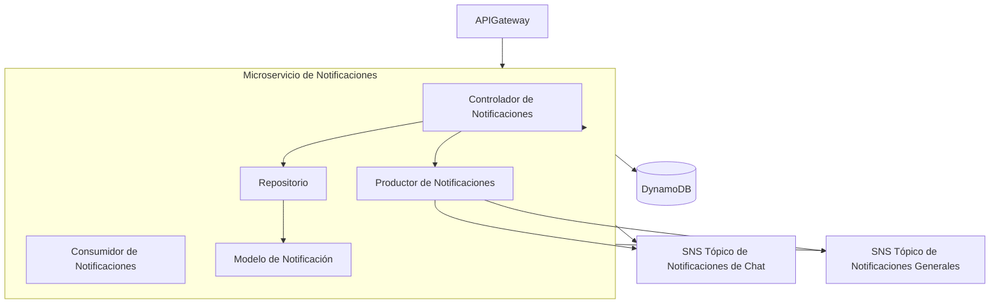

## Índice

0. [Ficha del proyecto](#0-ficha-del-proyecto)
1. [Descripción general del producto](#1-descripción-general-del-producto)
2. [Arquitectura del sistema](#2-arquitectura-del-sistema)
3. [Modelo de datos](#3-modelo-de-datos)
4. [Especificación de la API](#4-especificación-de-la-api)
5. [Historias de usuario](#5-historias-de-usuario)
6. [Tickets de trabajo](#6-tickets-de-trabajo)
7. [Pull requests](#7-pull-requests)

---

## 0. Ficha del proyecto

### **0.1. Tu nombre completo:**

*[Tu Nombre Completo]*

### **0.2. Nombre del proyecto:**

ChapuExpress

### **0.3. Descripción breve del proyecto:**

Esta plataforma conecta a clientes con profesionales de la industria del bricolaje y la construcción para facilitar la realización de pequeñas obras o reformas. Diseñada con un enfoque en la simplicidad, permite a los usuarios sin conocimientos técnicos describir sus necesidades de forma intuitiva. Los clientes podrán encontrar fácilmente el profesional adecuado para sus proyectos, mientras que los profesionales tendrán acceso a una base de clientes que buscan sus servicios.

### **0.4. URL del proyecto:**

>[Proporciona la URL del proyecto aquí. Puede ser pública o privada. Si es privada, comparte los accesos de manera segura con [alvaro@lidr.co](mailto:alvaro@lidr.co) usando servicios como [onetimesecret](https://onetimesecret.com/).]

### **0.5. URL o archivo comprimido del repositorio**

>[Proporciona la URL del repositorio o un archivo comprimido del mismo. Si es privado, comparte los accesos de manera segura con [alvaro@lidr.co](mailto:alvaro@lidr.co) usando servicios como [onetimesecret](https://onetimesecret.com/), o envía un archivo zip por correo.]

---

## 1. Descripción general del producto

> Describe en detalle los siguientes aspectos del producto:

### **1.1. Objetivo:**

El objetivo de esta plataforma es conectar a clientes y profesionales del bricolaje y la construcción, simplificando el proceso de contratación para pequeños proyectos y reformas. La plataforma busca reducir las barreras técnicas que muchos clientes encuentran al intentar expresar sus necesidades y ofrecer una experiencia accesible e intuitiva. Para lograrlo, incorpora un sistema de solicitud de presupuestos en el que los clientes describen su proyecto, y solo los profesionales interesados en realizar el trabajo envían sus propuestas económicas y de tiempos.

La plataforma prioriza la transparencia y la seguridad para ambas partes. Los clientes pueden comparar los presupuestos y elegir el profesional que mejor se ajuste a sus expectativas de calidad y precio sin necesidad de realizar búsquedas complejas. Por su parte, los profesionales encuentran un flujo de proyectos de manera constante y pueden certificar su experiencia y habilidades, aumentando su credibilidad y generando confianza entre los clientes.

Además, se incluyen funciones avanzadas como seguimiento de proyecto, valoración de ambas partes y un sistema de pagos seguro que facilita el cumplimiento de los acuerdos. De este modo, la plataforma se convierte en un espacio confiable para que clientes y profesionales puedan gestionar proyectos de bricolaje y construcción con claridad y respaldo, logrando que la experiencia sea satisfactoria para ambos.

### **1.2. Características y funcionalidades principales:**

#### Funcionalidades de la Plataforma

- **Registro y autenticación**: Proceso sencillo para que clientes y profesionales creen y verifiquen sus cuentas utilizando JWT para la gestión de autenticación.
- **Solicitud de presupuesto**: Los clientes pueden describir su proyecto, y la plataforma presenta estas solicitudes a profesionales relevantes para que envíen sus presupuestos.
- **Sistema de mensajería y notificaciones**: Comunicación segura entre clientes y profesionales, con notificaciones automáticas para actualizaciones clave como presupuestos recibidos y respuestas de profesionales.
- **Valoraciones y opiniones**: Al finalizar un proyecto, tanto el cliente como el profesional pueden dejar una valoración y comentario sobre su experiencia, ayudando a construir confianza.
- **Protección de pagos**: Sistema de pagos seguro en el que el cliente paga por adelantado, pero los fondos se liberan al profesional solo al completar el proyecto.
- **Soporte de proyecto y seguimiento**: Opcionalmente, el profesional puede actualizar el estado del proyecto y compartir fotos del progreso, permitiendo al cliente seguir el desarrollo del trabajo.
- **Centro de ayuda y chatbot de asistencia**: Un chatbot inteligente guía al cliente a describir su proyecto de manera precisa y responde dudas comunes.
- **Historial de proyectos y contratos**: Tanto clientes como profesionales pueden acceder a su historial de proyectos realizados y contratos previos.

#### Funcionalidades del Perfil del Cliente

- **Creación de perfil gratuito**: Los clientes pueden crear su perfil sin costo y optar por una suscripción mensual para acceder a funcionalidades avanzadas.
- **Solicitud de ayuda para describir el proyecto**: Con el apoyo del chatbot, los clientes pueden describir sus necesidades sin necesidad de conocimientos técnicos. El chatbot crea una hoja de trabajo detallada que facilita la comprensión por parte de los profesionales.
- **Recepción y comparación de presupuestos**: Los clientes solo ven a los profesionales que han enviado un presupuesto, evitando búsquedas manuales. Pueden revisar las propuestas y seleccionar la mejor opción según sus necesidades.
- **Sistema de valoración de profesionales**: Los clientes pueden dejar una valoración del profesional al finalizar el proyecto, ayudando a construir una reputación en la plataforma.
- **Suscripción a plan avanzado**: Para los clientes interesados en opciones adicionales, se ofrece un plan de pago mensual que incluye funcionalidades avanzadas como prioridad en la asignación de proyectos y soporte dedicado.

#### Funcionalidades del Perfil del Profesional

- **Registro con acreditación**: Los profesionales pueden registrarse y deben proporcionar documentación que acredite su identidad, experiencia y campo profesional.
- **Envío de presupuestos**: Los profesionales pueden revisar solicitudes de proyectos y enviar sus presupuestos directamente a los clientes interesados.
- **Certificación de habilidades y especialización**: Los profesionales pueden destacar áreas de especialización y obtener certificaciones que les permitan ganar credibilidad ante los clientes.
- **Gestión de cartera de proyectos**: Los profesionales pueden administrar sus proyectos y hacer un seguimiento de sus contratos y pagos en la plataforma.
- **Actualización de estado del proyecto**: Pueden mantener al cliente informado del avance del proyecto, proporcionando actualizaciones periódicas con fotos y comentarios.
- **Valoración de clientes**: Los profesionales pueden valorar a los clientes al final del proyecto, lo cual ayuda a otros profesionales a evaluar la confiabilidad de los clientes.

#### Funcionalidades Mínimas para el MVP

1. **Registro y autenticación** para clientes y profesionales.
2. **Creación de solicitud de presupuesto** donde el cliente puede describir su proyecto.
3. **Recepción y envío de presupuestos**: Los profesionales pueden responder con presupuestos a las solicitudes de los clientes.
4. **Sistema de mensajería básica**: Para la comunicación entre cliente y profesional.
5. **Valoración de usuarios**: Los clientes pueden calificar a los profesionales, y viceversa, tras finalizar un proyecto.
6. **Historial básico de proyectos**: Tanto para clientes como para profesionales, permitiendo revisar proyectos pasados.
7. **Sistema de pagos seguro** para proteger la transacción, aunque simplificado para esta fase inicial.

Estas funcionalidades proporcionan el núcleo esencial para una experiencia funcional y fluida en la plataforma. Una vez validado el MVP y recopilado feedback de los usuarios, se podrán agregar las funciones avanzadas para hacer la plataforma más completa y atractiva.

### **1.3. Diseño y experiencia de usuario:**

> Proporciona imágenes y/o videotutorial mostrando la experiencia del usuario desde que aterriza en la aplicación, pasando por todas las funcionalidades principales.

### **1.4. Instrucciones de instalación:**

> Documenta de manera precisa las instrucciones para instalar y poner en marcha el proyecto en local (librerías, backend, frontend, servidor, base de datos, migraciones y semillas de datos, etc.)

---

## 2. Arquitectura del Sistema

### **2.1. Diagrama de arquitectura:**

#### Diagrama Principal de Arquitectura

La arquitectura de ChapuExpress está basada en microservicios desplegados en AWS, asegurando escalabilidad, mantenibilidad y resiliencia. A continuación se detalla cada componente clave:


#### 1. **Frontend**
- **React Client**: Es la interfaz de usuario desarrollada con React.js. Responsable de interactuar con el usuario final, manejando la presentación y la lógica de la interfaz.

#### 2. **API Gateway**
- **AWS API Gateway**: Actúa como el punto de entrada principal para todas las solicitudes que provienen del cliente React. Gestiona el enrutamiento de las solicitudes a los microservicios adecuados en el backend, asegurando la seguridad, el control de tráfico y la gestión de APIs.

#### 3. **Backend Microservices**

Cada microservicio está implementado en **Node.js** utilizando **Express** y **TypeScript**, siguiendo los principios SOLID y DRY para una arquitectura robusta y mantenible. Los microservicios principales incluyen:

- **AuthService (Autenticación)**: Maneja la autenticación de usuarios, utilizando JWT para la gestión de tokens y control de acceso.
- **UserService (Gestión de Usuarios)**: Administra la información de los usuarios, incluyendo el registro, actualización y gestión de perfiles.
- **ProjectService (Gestión de Proyectos)**: Se encarga de la creación, actualización y gestión de proyectos dentro de la aplicación.
- **ChatService (Chat y Mensajería)**: Facilita la comunicación en tiempo real entre los usuarios mediante funcionalidades de chat y mensajería, utilizando Amazon SQS y DynamoDB para manejo eficiente de mensajes.
- **NotificationService (Notificaciones)**: Gestiona el envío de notificaciones a los usuarios, tanto en tiempo real como por otros medios, utilizando Amazon SNS.
- **PaymentService (Pagos Seguros)**: Maneja las transacciones financieras, integrándose con pasarelas de pago como Stripe o PayPal para asegurar transacciones seguras.
- **RatingService (Valoraciones)**: Permite a los usuarios calificar y valorar diferentes aspectos de la aplicación o servicios ofrecidos.

#### 4. **Base de Datos**
- **Amazon RDS (PostgreSQL)**: Utilizado por varios microservicios para almacenar datos estructurados como usuarios, proyectos, pagos, etc.
- **Amazon DynamoDB**: Utilizado por servicios que requieren alta escalabilidad y rendimiento, como el ChatService y NotificationService.

#### 5. **Almacenamiento en la Nube**
- **AWS S3**: Servicio de almacenamiento utilizado por el ProjectService para almacenar y gestionar archivos relacionados con proyectos, como documentos, imágenes, etc.

#### 6. **Sistema de Eventos**
- **Amazon SQS (Simple Queue Service)**: Utilizada por el ChatService para manejar la comunicación asíncrona y la gestión de mensajes, garantizando que los mensajes se procesen de manera eficiente.
- **Amazon SNS (Simple Notification Service)**: Utilizado por NotificationService para distribuir notificaciones a múltiples suscriptores, tanto para chat como para otras alertas relevantes.

#### 7. **Interacciones Entre Componentes**
- El **React Client** se comunica con el **API Gateway**, que luego enruta las solicitudes a los microservicios correspondientes.
- Los microservicios **AuthService**, **UserService**, **ProjectService**, **PaymentService** y **RatingService** interactúan con **Amazon RDS** para operaciones de lectura y escritura de datos.
- **ChatService** y **NotificationService** utilizan **Amazon DynamoDB** para manejar datos que requieren alta disponibilidad y rendimiento.
- **ProjectService** utiliza **AWS S3** para almacenar archivos relacionados con los proyectos.
- **ChatService** envía mensajes a **SQSQueue** para procesamiento asíncrono, mientras que **NotificationService** publica notificaciones en los tópicos **SNSChatTopic** y **SNSNotificationTopic** para informar a los usuarios en tiempo real.

#### 8. **Beneficios de esta Arquitectura**
- **Escalabilidad**: La utilización de microservicios y servicios gestionados como AWS API Gateway, RDS y DynamoDB permite escalar componentes individualmente según la demanda.
- **Mantenibilidad**: La separación de responsabilidades en diferentes servicios facilita el mantenimiento y la actualización del sistema sin afectar a otros componentes.
- **Resiliencia**: El uso de colas de mensajes y sistemas de notificaciones garantiza que el sistema pueda manejar fallos y picos de tráfico de manera eficiente.
- **Seguridad**: AWS API Gateway y los servicios de autenticación aseguran que las comunicaciones y los datos estén protegidos contra accesos no autorizados.

Esta arquitectura modular y basada en microservicios proporciona una base sólida para desarrollar aplicaciones robustas, escalables y fáciles de mantener.



---

#### Diagrama de Detalle: Microservicio de Chat y Mensajería



- **SQS Queue**: La cola de mensajes SQS permite manejar de manera asíncrona los mensajes enviados por los usuarios. Cuando un mensaje es enviado, se coloca en la cola, y el consumidor lo procesa y lo guarda en DynamoDB.

---

#### Diagrama de Detalle: Microservicio de Notificaciones



- **SNS Topics**:
  - **SNSChatTopic**: Tópico para notificar a los usuarios de nuevos mensajes de chat.
  - **SNSNotificationTopic**: Tópico para notificar a los usuarios de eventos importantes, como nuevos proyectos o presupuestos.

---

#### Diagrama de Despliegue General de la Plataforma

```mermaid
flowchart TD
    subgraph AWSRegion [AWS Región]
        subgraph VPC [VPC (Virtual Private Cloud)]
            APIGateway[AWS API Gateway]
            ECSCluster[AWS ECS Cluster]

            subgraph ECS [ECS Contenedores]
                AuthService[Servicio de Autenticación]
                UserService[Servicio de Usuarios]
                ProjectService[Servicio de Proyectos]
                ChatService[Servicio de Chat]
                NotificationService[Servicio de Notificaciones]
                PaymentService[Servicio de Pagos]
                RatingService[Servicio de Valoraciones]
            end

            RDS[(Amazon RDS)]
            DynamoDB[(Amazon DynamoDB)]
            S3[(Amazon S3)]
        end

        CloudFront[CloudFront CDN]
        Amplify[Amplify - Despliegue Frontend]
        SQSQueue[SQS Cola de Mensajes]
        SNSChatTopic[SNS Tópico de Notificaciones de Chat]
        SNSNotificationTopic[SNS Tópico de Notificaciones Generales]
    end

    ReactClient[Cliente React] --> CloudFront
    CloudFront --> Amplify
    ReactClient --> APIGateway
    APIGateway --> ECSCluster
    ECSCluster --> RDS
    ECSCluster --> DynamoDB
    ECSCluster --> S3
    ChatService --> SQSQueue
    NotificationService --> SNSChatTopic
    NotificationService --> SNSNotificationTopic
```

### **2.2. Descripción de componentes principales:**

La plataforma se compone de varios servicios y tecnologías que trabajan juntos para proporcionar una experiencia fluida y segura para clientes y profesionales. Los componentes principales se dividen en frontend, backend, bases de datos, sistema de eventos, y almacenamiento en la nube. A continuación, se detalla cada uno de ellos.

#### **Frontend**

- **React Client**: La interfaz de usuario se implementará en React.js, una biblioteca de JavaScript popular por su eficiencia y capacidad para crear aplicaciones de una sola página (SPA) rápidas y reactivas. React permite la creación de una experiencia de usuario intuitiva, ideal para usuarios sin conocimientos técnicos.
  - **Despliegue en AWS Amplify**: AWS Amplify simplifica el despliegue de aplicaciones frontend y permite integraciones fáciles con servicios backend. Amplify proporciona integración continua (CI/CD), despliegue seguro y autenticación nativa con AWS Cognito.

#### **API Gateway**

- **AWS API Gateway**: Este componente actúa como una puerta de enlace para todas las solicitudes del frontend hacia los microservicios del backend. API Gateway maneja la autenticación, la limitación de tasas (rate limiting), y la enrutación de peticiones hacia los microservicios correctos. API Gateway permite añadir lógica de autorización, autenticación y monitoreo a nivel de API.
  - **Ventajas**: API Gateway facilita la implementación de API RESTful y la escalabilidad de los microservicios al distribuir el tráfico según sea necesario.

#### **Backend Microservicios**

Cada microservicio está implementado en **Node.js** utilizando **Express** y **TypeScript**. Node.js es conocido por su alta capacidad de manejo de solicitudes en tiempo real, ideal para aplicaciones con componentes de mensajería y notificaciones.

1. **Microservicio de Autenticación**
   - **Descripción**: Gestiona la autenticación de usuarios y la autorización de roles. Este servicio verifica las credenciales de los usuarios y maneja la creación de tokens de autenticación.
   - **Tecnología**: Implementación en Node.js utilizando la librería `jsonwebtoken` para la gestión de autenticación y autorización, y usa el microservicio de gestión de usuarios para almacenar los datos de los usuarios.
   - **Funcionalidad clave**: Login, registro, y recuperación de contraseñas.

2. **Microservicio de Gestión de Usuarios**
   - **Descripción**: Gestiona los datos de los usuarios, incluyendo información de perfil, suscripciones y preferencias de notificaciones.
   - **Tecnología**: Implementación en Node.js y Express con almacenamiento en PostgreSQL.
   - **Funcionalidad clave**: Creación, edición y consulta de perfiles de usuarios, gestión de suscripciones.

3. **Microservicio de Gestión de Proyectos**
   - **Descripción**: Administra la creación y actualización de proyectos, donde los clientes pueden describir sus necesidades y recibir presupuestos de profesionales.
   - **Tecnología**: Implementación en Node.js y Express con almacenamiento en PostgreSQL para datos estructurados de los proyectos, y almacenamiento en AWS S3 para archivos adjuntos como imágenes o documentos.
   - **Funcionalidad clave**: Creación, actualización y consulta de proyectos.

4. **Microservicio de Chat y Mensajería**
   - **Descripción**: Facilita la comunicación en tiempo real entre clientes y profesionales a través de mensajes de chat. Utiliza una arquitectura basada en eventos para mejorar la escalabilidad y eficiencia del servicio.
   - **Tecnología**: Implementación en Node.js y Express con Amazon SQS para la cola de mensajes y DynamoDB para almacenar los historiales de chat.
   - **Funcionalidad clave**: Envío y recepción de mensajes, almacenamiento de historial de chat, notificaciones de nuevos mensajes a través de SNS.

5. **Microservicio de Notificaciones**
   - **Descripción**: Gestiona las notificaciones de la plataforma, incluyendo alertas de nuevos proyectos y presupuestos. Utiliza Amazon SNS para distribuir notificaciones a múltiples suscriptores.
   - **Tecnología**: Implementación en Node.js y Express con Amazon SNS para la entrega de notificaciones en tiempo real y DynamoDB para el registro de notificaciones enviadas.
   - **Funcionalidad clave**: Envío de notificaciones en tiempo real y persistencia de notificaciones para consultas futuras.

6. **Microservicio de Pagos Seguros**
   - **Descripción**: Gestiona el flujo de pagos entre clientes y profesionales, incluyendo pagos adelantados y liberación de fondos al finalizar los proyectos.
   - **Tecnología**: Implementación en Node.js con integración de pasarelas de pago como Stripe o PayPal y almacenamiento en PostgreSQL.
   - **Funcionalidad clave**: Procesamiento de pagos, protección de pagos en fideicomiso (escrow) y liberación de fondos.

7. **Microservicio de Valoraciones**
   - **Descripción**: Gestiona las valoraciones que los clientes y profesionales pueden realizar una vez finalizado un proyecto, permitiendo construir una reputación basada en las experiencias.
   - **Tecnología**: Implementación en Node.js y Express con almacenamiento en PostgreSQL.
   - **Funcionalidad clave**: Creación y consulta de valoraciones de usuarios.

#### **Sistema de Eventos**

1. **Amazon SQS (Simple Queue Service)**
   - **Descripción**: SQS gestiona la cola de mensajes para el servicio de chat, permitiendo que los mensajes enviados por los usuarios se almacenen temporalmente en una cola antes de ser procesados.
   - **Función**: Mejorar la escalabilidad y resiliencia del sistema de mensajería, asegurando que los mensajes no se pierdan y se procesen en orden.

2. **Amazon SNS (Simple Notification Service)**
   - **Descripción**: SNS permite la publicación de eventos y su distribución a múltiples suscriptores. Se utiliza para enviar notificaciones en tiempo real tanto para el chat como para alertas de nuevos proyectos y presupuestos.
   - **Función**: Facilitar el envío de notificaciones en tiempo real a los usuarios relevantes (clientes y profesionales) sin sobrecargar el sistema de microservicios.

#### **Bases de Datos**

1. **PostgreSQL**
   - **Descripción**: Sistema de gestión de bases de datos relacional de código abierto, conocido por su robustez, extensibilidad y cumplimiento de estándares SQL.
   - **Función**: Almacenar datos estructurados y relacionales de forma eficiente, proporcionando integridad referencial, transacciones ACID, y consultas complejas.

2. **MongoDB**
   - **Descripción**: Base de datos NoSQL orientada a documentos que almacena datos en formato JSON o BSON, ideal para estructuras de datos cambiantes.
   - **Ventajas**:
     - **Integración sencilla con Node.js**: Uso de `mongoose` facilita la manipulación de documentos.
     - **Flexibilidad de esquemas**: No requiere un esquema fijo, ideal para datos dinámicos.
     - **Compatibilidad con TypeScript**: Soporte de tipado mediante `mongoose` y definiciones de interfaces.

#### **Almacenamiento en la Nube**

- **Amazon S3 (Simple Storage Service)**: Utilizado para almacenar archivos de proyectos, imágenes y documentos adjuntos. S3 es una opción económica y escalable para el almacenamiento de archivos, con alta disponibilidad y redundancia. Puede integrarse con CloudFront para servir archivos estáticos de manera eficiente.
  - **Función**: Almacenar archivos estáticos y multimedia de manera segura y escalable.

#### **Interacciones y Despliegue**

1. **Despliegue en AWS**
   - **ECS (Elastic Container Service)**: Despliega los microservicios en contenedores gestionados, facilitando la escalabilidad y el mantenimiento.
   - **CloudFront CDN**: Distribuye contenido estático de manera eficiente a nivel global.
   - **Amplify**: Despliega el frontend en React.js, integrándose fácilmente con backend y servicios de autenticación.

2. **Comunicación entre Servicios**
   - Los microservicios se comunican a través del API Gateway, utilizando JWT para autenticación y autorización.
   - Los sistemas de mensajería y notificaciones utilizan SQS y SNS para manejar comunicaciones asíncronas y en tiempo real.

### **2.3. Descripción de alto nivel del proyecto y estructura de ficheros**

#### **Componentes Principales del Proyecto**

La plataforma se basa en los siguientes componentes principales:

1. **Frontend**: 
   - **React.js**: Aplicación cliente que proporciona la interfaz de usuario.
   - **TypeScript**: Utilizado para garantizar tipificación estática y robustez en el frontend.
   - **Estructura de Ficheros**:
     ```typescript:frontend/
     frontend/
     │
     ├── public/                     # Archivos estáticos
     │   ├── index.html              # Página HTML principal
     │   └── assets/                 # Recursos multimedia
     │
     ├── src/
     │   ├── components/             # Componentes reutilizables de la UI
     │   │   ├── Navbar.tsx
     │   │   ├── ChatBox.tsx
     │   │   └── ProjectForm.tsx
     │   │
     │   ├── pages/                  # Páginas principales de la aplicación
     │   │   ├── HomePage.tsx
     │   │   ├── ProjectPage.tsx
     │   │   ├── ProfilePage.tsx
     │   │   └── ChatPage.tsx
     │   │
     │   ├── services/               # Servicios de conexión con la API
     │   │   ├── authService.ts
     │   │   ├── projectService.ts
     │   │   ├── chatService.ts
     │   │   └── notificationService.ts
     │   │
     │   ├── hooks/                  # Custom hooks
     │   │   ├── useAuth.ts
     │   │   └── useNotifications.ts
     │   │
     │   ├── context/                # Contexto global de la aplicación
     │   │   ├── AuthContext.tsx
     │   │   └── NotificationContext.tsx
     │   │
     │   ├── types/                  # Tipos y interfaces de TypeScript
     │   │   ├── User.ts
     │   │   ├── Project.ts
     │   │   ├── Chat.ts
     │   │   └── Notification.ts
     │   │
     │   ├── utils/                  # Utilidades y funciones auxiliares
     │   │   └── formatDate.ts
     │   │
     │   └── App.tsx                 # Componente raíz
     │
     └── tsconfig.json               # Configuración de TypeScript
     └── package.json                # Configuración de dependencias
     ```

2. **API Gateway**:
   - **AWS API Gateway**: Centraliza las solicitudes del cliente, controla el tráfico, autentica usuarios y enruta las solicitudes a los microservicios correspondientes en el backend.

3. **Microservicios del Backend**:
   - **Implementados en Node.js con TypeScript**, cada microservicio es independiente y maneja funciones específicas, lo que facilita su despliegue y escalabilidad de forma individual.
   - **Estructura de Ficheros**:
     ```typescript:backend/
     backend/
     │
     ├── auth-service/               # Servicio de Autenticación
     │   ├── src/
     │   │   ├── controllers/        # Controladores de la API
     │   │   │   └── authController.ts
     │   │   ├── middlewares/        # Middlewares
     │   │   │   └── auth.middleware.ts
     │   │   ├── models/             # Modelos de datos
     │   │   │   └── User.ts
     │   │   ├── routes/             # Rutas de la API
     │   │   │   └── authRoutes.ts
     │   │   ├── services/           # Lógica de negocio
     │   │   │   ├── authService.ts
     │   │   │   └── email.service.ts
     │   │   ├── utils/              # Utilidades y funciones auxiliares
     │   │   │   └── errors.ts
     │   │   ├── config/             # Configuración del servicio
     │   │   │   └── index.ts
     │   │   └── index.ts            # Punto de entrada del servicio
     │   └── tsconfig.json           # Configuración de TypeScript para este microservicio
     │
     ├── project-service/            # Servicio de Gestión de Proyectos
     │   ├── src/
     │   │   ├── controllers/
     │   │   ├── models/
     │   │   ├── routes/
     │   │   ├── services/
     │   │   ├── types/
     │   │   ├── utils/              # Utilidades específicas del servicio
     │   │   └── index.ts
     │   └── tsconfig.json
     │
     ├── chat-service/               # Servicio de Chat y Mensajería
     │   ├── src/
     │   │   ├── controllers/
     │   │   ├── models/
     │   │   ├── routes/
     │   │   ├── services/
     │   │   ├── queue/              # Manejo de colas de mensajes con SQS
     │   │   ├── types/
     │   │   └── index.ts
     │   └── tsconfig.json
     │
     ├── notification-service/       # Servicio de Notificaciones
     │   ├── src/
     │   │   ├── controllers/
     │   │   ├── models/
     │   │   ├── routes/
     │   │   ├── services/
     │   │   ├── sns/                # Configuración de tópicos de SNS
     │   │   ├── types/
     │   │   └── index.ts
     │   └── tsconfig.json
     │
     └── payment-service/            # Servicio de Pagos Seguros
         ├── src/
         │   ├── controllers/
         │   ├── models/
         │   ├── routes/
         │   ├── services/
         │   ├── types/
         │   └── index.ts
         └── tsconfig.json
     ```

4. **Sistema de Eventos**:
   - **Amazon SQS y SNS**: Manejan la mensajería y notificaciones en tiempo real, respectivamente, desacoplando la comunicación entre microservicios y mejorando la escalabilidad.

5. **Bases de Datos y Almacenamiento**:
   - **Amazon RDS**: Base de datos relacional para almacenar datos estructurados.
   - **Amazon DynamoDB**: Base de datos NoSQL para datos de mensajería y notificaciones.
   - **Amazon S3**: Almacenamiento de archivos multimedia, documentos y recursos estáticos del proyecto.

#### **Estructura de Ficheros del Sistema de Eventos**

El sistema de eventos se implementa directamente en los microservicios de **Chat** y **Notificaciones**, ya que estos son los encargados de interactuar con **Amazon SQS** y **Amazon SNS**. Los archivos de configuración específicos de SQS y SNS se encuentran en los directorios `queue` y `sns` dentro de los microservicios correspondientes.

#### **Infraestructura de Bases de Datos y Almacenamiento**

La infraestructura de bases de datos y almacenamiento se gestiona mediante servicios en AWS. La configuración y administración de estos recursos se definen en el despliegue utilizando herramientas como **AWS CloudFormation** o **Terraform** para mantener la infraestructura como código.

#### **Resumen del Flujo de Datos en la Arquitectura**

1. **Autenticación**: Los usuarios inician sesión mediante el frontend en React, que se comunica con el `AuthService` a través del API Gateway.
2. **Creación de Proyectos y Solicitud de Presupuestos**: Los clientes envían los detalles del proyecto al `ProjectService`, donde los profesionales pueden visualizarlo y enviar presupuestos.
3. **Chat en Tiempo Real**: Los mensajes de chat se envían al `ChatService`, que los coloca en la cola SQS. El servicio procesa los mensajes y envía notificaciones de nuevos mensajes a los usuarios a través de SNS.
4. **Notificaciones**: El `NotificationService` envía alertas relevantes a los usuarios (nuevos proyectos, presupuestos) a través de SNS.
5. **Pagos Seguros**: Los pagos se gestionan a través del `PaymentService`, asegurando transacciones protegidas y liberación de fondos al finalizar los proyectos.
6. **Valoraciones**: Tras completar un proyecto, tanto clientes como profesionales pueden dejar valoraciones que son manejadas por el `RatingService`.

---

## 3. Modelo de datos

El modelo de datos está diseñado utilizando **Prisma ORM**, facilitando la interacción con bases de datos PostgreSQL. A continuación, se detallan los principales modelos utilizados en la plataforma.

### **Usuarios**

- **Campos principales**:
  - `user_id`: Identificador único del usuario.
  - `name`: Nombre completo del usuario.
  - `email`: Correo electrónico único.
  - `password`: Contraseña hash.
  - `role`: Rol del usuario (cliente o profesional).
  - `created_at` y `updated_at`: Tiempos de creación y actualización del registro.

### **Proyectos**

- **Campos principales**:
  - `project_id`: Identificador único del proyecto.
  - `client_id`: Referencia al cliente que crea el proyecto.
  - `professional_id`: Referencia al profesional asignado (opcional).
  - `title`: Título del proyecto.
  - `description`: Descripción detallada del proyecto.
  - `status`: Estado del proyecto (open, in_progress, completed, closed).
  - `created_at` y `updated_at`: Tiempos de creación y actualización del registro.

### **Presupuestos**

- **Campos principales**:
  - `quote_id`: Identificador único del presupuesto.
  - `project_id`: Referencia al proyecto relacionado.
  - `professional_id`: Referencia al profesional que envía el presupuesto.
  - `amount`: Monto del presupuesto.
  - `message`: Mensaje opcional del profesional.
  - `status`: Estado del presupuesto (pending, accepted, rejected).
  - `created_at` y `updated_at`: Tiempos de creación y actualización del registro.

### **Valoraciones**

- **Campos principales**:
  - `rating_id`: Identificador único de la valoración.
  - `project_id`: Referencia al proyecto valorado.
  - `client_id`: Referencia al cliente que realiza la valoración.
  - `professional_id`: Referencia al profesional valorado.
  - `rating`: Puntuación otorgada.
  - `comment`: Comentario opcional.
  - `created_at` y `updated_at`: Tiempos de creación y actualización del registro.

### **Chats**

- **Campos principales**:
  - `chat_id`: Identificador único del chat.
  - `project_id`: Referencia al proyecto asociado.
  - `messages`: Lista de mensajes dentro del chat, almacenados en DynamoDB para alta disponibilidad y rendimiento.
  - `created_at` y `updated_at`: Tiempos de creación y actualización del registro.

---

## 4. Especificación de la API

La API de ChapuExpress está diseñada siguiendo principios RESTful, proporcionando endpoints claros y seguros para interactuar con los diferentes recursos de la plataforma. A continuación, se detallan los principales endpoints disponibles.

### **Autenticación**

- `POST /auth/register`: Registrar un nuevo usuario.
- `POST /auth/login`: Iniciar sesión y obtener un token JWT.
- `POST /auth/forgot-password`: Solicitar recuperación de contraseña.
- `POST /auth/reset-password`: Restablecer la contraseña usando un token.

### **Usuarios**

- `GET /users/:id`: Obtener información de un usuario específico (requiere autenticación).
- `PUT /users/:id`: Actualizar información de un usuario (requiere autenticación y permisos).
- `GET /users/me`: Obtener información del usuario autenticado.

### **Proyectos**

- `POST /projects`: Crear un nuevo proyecto (cliente autenticado).
- `PUT /projects/:id`: Actualizar un proyecto existente (cliente autenticado).
- `GET /projects/:id`: Obtener detalles de un proyecto específico.
- `GET /projects`: Listar todos los proyectos del cliente autenticado.
- `POST /projects/:id/assign`: Asignar un profesional a un proyecto (cliente autenticado).

### **Presupuestos**

- `POST /quotes`: Crear un nuevo presupuesto (profesional autenticado).
- `PUT /quotes/:id`: Actualizar un presupuesto existente (profesional autenticado).
- `POST /quotes/:id/retract`: Retirar un presupuesto (profesional autenticado).
- `GET /quotes/project/:projectId`: Listar todos los presupuestos asociados a un proyecto.
- `GET /quotes/professional`: Listar todos los presupuestos enviados por el profesional autenticado.

### **Chats**

- `GET /chats/:projectId`: Obtener el historial del chat de un proyecto específico.
- `POST /chats/:projectId/messages`: Enviar un nuevo mensaje en el chat de un proyecto.

### **Notificaciones**

- `GET /notifications`: Obtener todas las notificaciones del usuario autenticado.
- `PUT /notifications/:id/read`: Marcar una notificación como leída.

### **Pagos**

- `POST /payments/create`: Crear una nueva transacción de pago.
- `GET /payments/:id`: Obtener detalles de una transacción específica.
- `PUT /payments/:id/release`: Liberar fondos al profesional tras completar el proyecto.

### **Valoraciones**

- `POST /ratings`: Crear una nueva valoración para un proyecto completado.
- `GET /ratings/:projectId`: Obtener todas las valoraciones de un proyecto específico.

#### Ejemplos de Solicitudes y Respuestas

---

## 5. Historias de Usuario

Aquí tienes las historias de usuario para el MVP, detalladas y con los casos de uso separados para una mayor claridad.

---

### **Historia de Usuario 1: Registro y Autenticación de Usuario**

#### **1.1 Registro de Usuario**

> **Como** usuario nuevo, **quiero** registrarme en la plataforma **para** poder acceder a las funcionalidades de proyectos y presupuestos.

- **Criterios de Aceptación**:
  - El usuario debe poder registrarse proporcionando los siguientes datos obligatorios:
    - Correo electrónico único
    - Nombre de usuario único
    - Contraseña segura
  - El sistema valida que el correo electrónico y el nombre de usuario sean únicos y muestra un mensaje de error si ya existen.
  - El usuario recibe un correo de confirmación para activar su cuenta antes de iniciar sesión.
  - La contraseña debe cumplir con los requisitos de seguridad (mínimo 8 caracteres, al menos una mayúscula, un número y un carácter especial).
  - Al completar el registro, el usuario es redirigido a la pantalla de confirmación.

#### **1.2 Inicio de Sesión**

> **Como** usuario registrado, **quiero** iniciar sesión en la plataforma **para** acceder a mis proyectos, presupuestos y funciones de comunicación de forma segura.

- **Criterios de Aceptación**:
  - El usuario debe poder iniciar sesión con su correo electrónico o nombre de usuario y su contraseña.
  - Si las credenciales son correctas, el sistema genera un token JWT y lo devuelve al usuario para futuras autenticaciones.
  - Si las credenciales son incorrectas, el sistema muestra un mensaje de error y no permite el acceso.
  - El token JWT tiene un tiempo de expiración adecuado, y el usuario debe volver a iniciar sesión una vez caducado.

---

### **Historia de Usuario 2: Creación y Gestión de Proyectos por el Cliente**

#### **2.1 Crear Proyecto**

> **Como** cliente, **quiero** crear un proyecto detallando mis necesidades de bricolaje o reforma **para** recibir presupuestos de profesionales interesados.

- **Criterios de Aceptación**:
  - El cliente debe poder crear un proyecto proporcionando:
    - Título del proyecto (obligatorio)
    - Descripción detallada del proyecto (obligatorio)
  - El proyecto se guarda en el sistema con el estado "abierto" y está disponible para que los profesionales lo vean y envíen presupuestos.
  - Si el título o la descripción están vacíos, el sistema muestra un mensaje de error y no permite crear el proyecto.
  - Al crear el proyecto, el cliente es redirigido a la pantalla de detalles del proyecto.

#### **2.2 Ver Proyectos Propios**

> **Como** cliente, **quiero** ver una lista de los proyectos que he creado **para** hacer seguimiento de los presupuestos recibidos y el estado de cada proyecto.

- **Criterios de Aceptación**:
  - El cliente debe poder ver una lista de todos sus proyectos, incluyendo el título, estado y fecha de creación de cada uno.
  - Para cada proyecto, el cliente debe poder ver los presupuestos asociados y su estado (pendiente, aceptado, rechazado).
  - La lista de proyectos se ordena por fecha de creación, mostrando los proyectos más recientes primero.

#### **2.3 Actualizar Proyecto**

> **Como** cliente, **quiero** poder actualizar los detalles de un proyecto que he creado **para** añadir o corregir información importante antes de aceptar un presupuesto.

- **Criterios de Aceptación**:
  - El cliente debe poder editar el título y la descripción del proyecto.
  - Las actualizaciones solo están permitidas si el proyecto está en estado “abierto” (no se puede editar un proyecto una vez aceptado un presupuesto).
  - El sistema valida los datos ingresados nuevamente y guarda las actualizaciones.
  - Tras actualizar, el cliente es redirigido a la pantalla de detalles del proyecto con los cambios reflejados.

---

### **Historia de Usuario 3: Envío y Gestión de Presupuestos por el Profesional**

#### **3.1 Enviar Presupuesto para un Proyecto**

> **Como** profesional, **quiero** enviar un presupuesto a un proyecto de cliente **para** ofrecer mis servicios y participar en la contratación.

- **Criterios de Aceptación**:
  - El profesional debe poder enviar un presupuesto para un proyecto "abierto", proporcionando:
    - Monto del presupuesto (obligatorio)
    - Mensaje explicativo o detalles adicionales (opcional)
  - El presupuesto se guarda con el estado "pendiente" y el cliente es notificado de la recepción del presupuesto.
  - El profesional recibe un mensaje de confirmación al enviar el presupuesto.
  - El profesional no puede enviar más de un presupuesto para el mismo proyecto (solo puede modificar o retirar el presupuesto enviado).

#### **3.2 Ver Presupuestos Propios**

> **Como** profesional, **quiero** ver una lista de los presupuestos que he enviado **para** revisar su estado y hacer seguimiento de los proyectos que me interesan.

- **Criterios de Aceptación**:
  - El profesional debe poder ver una lista de los presupuestos enviados, incluyendo:
    - Título del proyecto asociado
    - Estado del presupuesto (pendiente, aceptado, rechazado)
    - Monto del presupuesto
    - Fecha de envío del presupuesto
  - La lista de presupuestos se ordena por fecha de creación, mostrando primero los más recientes.
  - Al seleccionar un presupuesto, el profesional puede ver los detalles del proyecto y el mensaje enviado junto con el presupuesto.

#### **3.3 Modificar o Retirar Presupuesto**

> **Como** profesional, **quiero** poder modificar o retirar un presupuesto enviado **para** actualizar la oferta o cancelar mi participación antes de que el cliente lo acepte.

- **Criterios de Aceptación**:
  - El profesional debe poder editar el monto y el mensaje de un presupuesto en estado "pendiente" hasta que el cliente lo acepte.
  - Si el profesional retira un presupuesto, el estado cambia a "retirado" y el cliente recibe una notificación de que el presupuesto ha sido cancelado.
  - El profesional no puede modificar un presupuesto una vez que el cliente lo ha aceptado o rechazado.
  
---

## 6. Tickets de Trabajo

Para documentar los tickets de trabajo, cada uno se enfocará en una parte específica del proyecto (backend, frontend y bases de datos). Los tickets detallarán los objetivos, los criterios de aceptación, los pasos a seguir, las dependencias y cualquier consideración adicional necesaria para su correcta implementación.

---

#### **Ticket de Trabajo 1: Backend - Implementar Endpoint para Crear Proyecto**

- **ID**: BE-001
- **Título**: Implementar Endpoint para Crear Proyecto
- **Prioridad**: Alta
- **Justificación de Prioridad**: La capacidad de crear proyectos es una funcionalidad central para los clientes en el MVP, y muchos otros procesos dependen de este endpoint. Por lo tanto, este ticket tiene prioridad alta para asegurar que los clientes puedan crear proyectos en la plataforma.
- **Descripción**: Implementar un endpoint en el `project-service` que permita a un cliente crear un nuevo proyecto proporcionando un título y una descripción. Este endpoint debe validar los datos de entrada, almacenar el proyecto en la base de datos y devolver los detalles del proyecto creado.

- **Criterios de Aceptación**:
  - El endpoint debe aceptar una solicitud `POST` en la ruta `/projects`.
  - La solicitud debe incluir un token JWT en el encabezado `Authorization`.
  - El cuerpo de la solicitud debe contener los campos `title` (string) y `description` (string).
  - Si los datos de entrada son válidos y el usuario está autenticado, el proyecto debe ser creado y almacenado en la base de datos con el estado `open`.
  - El endpoint debe devolver una respuesta `201 Created` con los detalles del proyecto (ID, título, descripción, estado, fechas de creación).
  - En caso de datos de entrada inválidos, el endpoint debe devolver un `400 Bad Request` con un mensaje de error.
  - Si el usuario no está autenticado, el endpoint debe devolver un `401 Unauthorized`.

- **Pasos para Desarrollar la Tarea**:
  1. **Crear Rutas**: Añadir la ruta `POST /projects` en el archivo de rutas del `project-service`.
  2. **Crear Controlador**: Implementar el método `createProject` en el controlador, que se encargue de validar los datos de entrada y llamar al servicio correspondiente.
  3. **Validar Datos**: Usar una librería como `express-validator` para validar que `title` y `description` no estén vacíos.
  4. **Implementar Servicio**: Crear un servicio que interactúe con el modelo de la base de datos para guardar el nuevo proyecto. Asegurarse de que el `client_id` se asigne a partir del token JWT decodificado.
  5. **Actualizar Modelo**: Revisar el modelo `Project` para asegurarse de que se incluyan todos los campos requeridos y que las restricciones (como `NOT NULL`) estén configuradas correctamente.
  6. **Escribir Tests**: Crear pruebas unitarias y de integración usando `Jest` para verificar que:
     - El proyecto se crea correctamente cuando los datos son válidos.
     - Se devuelve un error `400` si faltan datos obligatorios.
     - Se devuelve un error `401` si el usuario no está autenticado.
  7. **Actualizar Documentación**: Asegurarse de que el endpoint esté documentado en la especificación de OpenAPI (Swagger) y que los ejemplos de peticiones y respuestas sean claros.
  8. **Realizar Code Review**: Solicitar una revisión de código antes de hacer merge a la rama principal.

- **Dependencias**:
  - Debe estar implementada la autenticación y autorización mediante JWT.
  - El modelo `Project` debe estar configurado en la base de datos.

---

#### **Ticket de Trabajo 2: Frontend - Implementar Formulario de Creación de Proyecto**

- **ID**: FE-001
- **Título**: Implementar Formulario de Creación de Proyecto
- **Prioridad**: Media
- **Justificación de Prioridad**: El formulario de creación de proyectos es fundamental para la experiencia del usuario, ya que permite a los clientes crear y detallar sus proyectos. Sin embargo, depende del endpoint del backend (`BE-001`), por lo que su prioridad es media y su desarrollo se puede planificar tras la implementación del endpoint.
- **Descripción**: Crear un formulario en la interfaz de usuario para que los clientes puedan crear un proyecto, proporcionando un título y una descripción. Este formulario debe validar los campos de entrada y enviar la solicitud al backend mediante un servicio API.

- **Criterios de Aceptación**:
  - El formulario debe incluir los siguientes campos:
    - `title`: Input de texto para el título del proyecto, requerido.
    - `description`: Textarea para la descripción del proyecto, requerido.
  - El formulario debe validar que ambos campos estén completos antes de permitir el envío.
  - Si los datos son válidos, el formulario debe realizar una solicitud `POST` al endpoint `/projects` del backend.
  - Debe mostrar un mensaje de éxito si el proyecto se crea correctamente y redirigir al usuario a la vista de detalles del proyecto.
  - En caso de error, debe mostrar un mensaje adecuado (por ejemplo, "El título es obligatorio" o "Por favor, inicie sesión").
  - Debe ser compatible con dispositivos móviles (diseño responsive).

- **Pasos para Desarrollar la Tarea**:
  1. **Crear Componente**: Crear un componente `ProjectForm.tsx` en el directorio `components/`.
  2. **Definir el Formulario**: Utilizar `React Hook Form` para gestionar el formulario y aplicar validaciones.
  3. **Integrar Servicio API**: En el directorio `services/`, crear o actualizar el archivo `projectService.ts` para incluir la función `createProject` que realice la solicitud `POST`.
  4. **Mostrar Mensajes**: Usar un `Toast` o componente de notificación para mostrar el mensaje de éxito o error al usuario.
  5. **Pruebas Unitarias**: Escribir pruebas con `React Testing Library` para verificar:
     - La visualización del formulario.
     - Las validaciones de los campos.
     - La llamada al servicio `createProject` cuando el formulario es válido.
     - El manejo de errores (mostrar mensajes adecuados).
  6. **Estilos Responsivos**: Asegurarse de que el formulario se adapte a diferentes tamaños de pantalla usando `styled-components` o `CSS modules`.
  7. **Revisión de Accesibilidad**: Verificar que el formulario sea accesible, con etiquetas `aria` adecuadas para los campos y botones.
  8. **Realizar Code Review**: Solicitar una revisión de código antes de hacer merge a la rama principal.

- **Dependencias**:
  - El endpoint `POST /projects` en el backend debe estar disponible.
  - El usuario debe estar autenticado para crear un proyecto.

---

#### **Ticket de Trabajo 3: Base de Datos - Crear Tabla para Almacenar Proyectos**

- **ID**: DB-001
- **Título**: Crear Tabla `projects` para Almacenar Información de Proyectos
- **Prioridad**: Alta
- **Justificación de Prioridad**: La tabla `projects` es esencial para almacenar los proyectos creados por los clientes. Este ticket tiene prioridad alta ya que es un requisito previo para implementar el endpoint de creación de proyectos (BE-001).
- **Descripción**: Crear la tabla `projects` en la base de datos para almacenar la información de los proyectos creados por los clientes, incluyendo las claves necesarias para enlazar los proyectos con los usuarios (clientes).

- **Criterios de Aceptación**:
  - La tabla `projects` debe incluir las siguientes columnas:
    - `project_id` (UUID, PK): Identificador único del proyecto.
    - `client_id` (UUID, FK): Identificador del cliente que creó el proyecto.
    - `title` (VARCHAR(255), NOT NULL): Título del proyecto.
    - `description` (TEXT, NOT NULL): Descripción detallada del proyecto.
    - `status` (ENUM: `open`, `in_progress`, `completed`, `closed`, DEFAULT `open`): Estado del proyecto.
    - `created_at` (TIMESTAMP, DEFAULT CURRENT_TIMESTAMP): Fecha y hora de creación.
    - `updated_at` (TIMESTAMP, DEFAULT CURRENT_TIMESTAMP): Fecha y hora de última actualización.
  - La columna `client_id` debe ser una clave foránea que referencia a `user_id` de la tabla `users`.
  - La tabla debe incluir índices para `client_id` y `status` para optimizar las consultas.

- **Pasos para Desarrollar la Tarea**:
  1. **Definir la Migración**: Crear un script de migración SQL para definir la tabla `projects` con las columnas y restricciones indicadas.
  2. **Definir las Relaciones**: Asegurarse de que `client_id` esté correctamente relacionado con la tabla `users` mediante una clave foránea.
  3. **Implementar Índices**: Definir índices en `client_id` y `status` para mejorar el rendimiento de las consultas que filtren proyectos por cliente o estado.
  4. **Ejecutar la Migración**: Aplicar el script de migración en el entorno de desarrollo y verificar que la tabla se haya creado correctamente.
  5. **Pruebas de Integridad**: Realizar pruebas de integridad para verificar que:
     - No se puedan insertar proyectos sin un `client_id` válido.
     - No se puedan insertar proyectos con títulos o descripciones vacíos.
  6. **Documentar la Migración**: Asegurarse de que la migración esté documentada en el archivo `README` del repositorio de migraciones.
  7. **Realizar Code Review**: Solicitar una revisión de la migración antes de aplicarla en el entorno de producción.

- **Dependencias**:
  - La tabla `users` debe estar disponible con la columna `user_id` como clave primaria.

---

## 7. Pull Requests

> Documenta 3 de las Pull Requests realizadas durante la ejecución del proyecto

**Pull Request 1**
Primera PR para la generación de la documentación del proyecto.
Desde la rama 'documentation' a la rama 'main'.
Descripción: Se ha creado la documentación del proyecto en formato Markdown, incluyendo la estructura de ficheros, el diagrama del modelo de datos, la especificación de la API, y una introducción a la arquitectura del proyecto.
**Pull Request 2**

**Pull Request 3**

